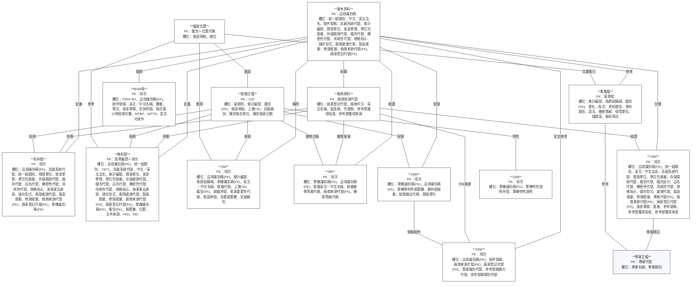

```mermaid
%%{init: {'flowchart': {'curve': 'linear', 'nodeSpacing': 40, 'rankSpacing': 60}, 'themeVariables': {'fontSize': '12px', 'primaryColor': '#ffffff', 'primaryBorderColor': '#3b4861'}} }%%
flowchart TB
    classDef entity fill:#ffffff,stroke:#3b4861,stroke-width:1px,corner-radius:6px;
    classDef ref fill:#f6f8fe,stroke:#3b4861,stroke-width:1px,corner-radius:6px;

    基本資料["**基本資料**<br/>PK：品項識別碼<br/>欄位：統一組類別、中文／英文品名、配件號碼、武器系統代號、會計編號、撥發單位、美金單價、單位包裝量、存儲壽限代號、檔別代號、機密性代號、消耗性代號、規格指示、儲存型式、壽限處理代號、製造能量、修理能量、廠商來源代號(FK)、廠家登記代號(FK)"]:::entity

    廠商資料["**廠商資料**<br/>PK：廠商來源代號<br/>欄位：廠家登記代號、廠商中文／英文名稱、製造商、代理商、參考號獲得程度、參考號獲得來源"]:::entity

    裝備主檔["**裝備主檔**<br/>PK：CID<br/>欄位：組類別、會計編號、艦型(FK)、裝設地點、上層CID、武器級別、構型報告單位、構型報表日期"]:::entity

    艦艇位置["**艦艇位置**<br/>PK：艦型＋位置代碼<br/>欄位：裝設地點、儲位"]:::entity

    有料號["**有料號**<br/>PK：項次<br/>欄位：品項識別碼(FK)、武器系統代號、統一組類別、撥發單位、美金單價、單位包裝量、存儲壽限代號、檔別代號、品名代號、機密性代號、消耗性代號、規格指示、海軍軍品來源、儲存型式、壽限處理代號、製造能量、修理能量、廠商來源代號(FK)、廠家登記代號(FK)、單機識別碼(FK)"]:::entity

    無料號["**無料號**<br/>PK：表單編號＋項次<br/>欄位：品項識別碼(FK)、統一組類別、YETL、武器系統代號、中文／英文品名、會計編號、撥發單位、美金單價、單位包裝量、存儲壽限代號、檔別代號、品名代號、機密性代號、消耗性代號、規格指示、海軍軍品來源、儲存型式、壽限處理代號、製造能量、修理能量、廠商來源代號(FK)、廠家登記代號(FK)、單機識別碼(FK)、艦型(FK)、裝置數、位置、文件來源、FIIG、INC"]:::entity

    BOM表["**BOM表**<br/>PK：項次<br/>欄位：ITEM NO、品項識別碼(FK)、配件號碼、英文／中文名稱、數量、單位、美金單價、交貨時間、每百萬小時故障次數、MTBF、MTTR、是否可修件"]:::entity

    M2表["**2M**<br/>PK：項次<br/>欄位：品項識別碼(FK)、會計編號、族群結構碼、單機識別碼(FK)、英文／中文名稱、裝備代號、上層CID、艦型(FK)、裝備序號、軍事重要性代碼、裝設地點、全艦裝置數、武器級別"]:::entity

    M3表["**3M**<br/>PK：項次<br/>欄位：單機識別碼(FK)、品項識別碼(FK)、裝備英文／中文名稱、裝備維修等級代碼、廠商來源代號(FK)、機密等級代碼"]:::entity

    M18表["**18M**<br/>PK：項次<br/>欄位：單機識別碼(FK)、品項識別碼(FK)、單機零附件裝置數、額外配賦量、配賦備註代碼、撥發單位"]:::entity

    M19表["**19M**<br/>PK：項次<br/>欄位：品項識別碼(FK)、統一組類別、英文／中文品名、武器系統代號、撥發單位、單位包裝量、存儲壽限代號、檔別代號、檔別區分、品名代號、機密性代號、消耗性代號、規格指示、儲存型式、處理代號、製造能量、修理能量、專案代號(FK)、廠商來源代號(FK)、廠家登記代號(FK)、美金單價、重量、參考號碼、參考號獲得程度、參考號獲得來源"]:::entity

    M20表["**20M**<br/>PK：項次<br/>欄位：品項識別碼(FK)、配件號碼、廠商來源代號(FK)、廠家登記代號(FK)、管理識別代號、參考號碼變化代號、參考號碼類別代號"]:::entity

    M16表["**16M**<br/>PK：項次<br/>欄位：單機識別碼(FK)、單機特性說明序號、單機特性說明"]:::entity

    書籍檔["**書籍檔**<br/>PK：索書號<br/>欄位：會計編號、族群結構碼、艦型(FK)、書名、版次、資料類型、資料類別、語言、機密等級、保管單位、儲放室、服役現況"]:::entity

    專案主檔["**專案主檔**<br/>PK：專案代號<br/>欄位：專案名稱、專案類別"]:::ref

    基本資料 ---|採購| 廠商資料
    基本資料 ---|定義| 有料號
    基本資料 ---|定義| 無料號
    基本資料 ---|展開| BOM表
    基本資料 ---|構改| M2表
    基本資料 ---|維護| M3表
    基本資料 ---|配賦| M18表
    基本資料 ---|分類| M19表
    基本資料 ---|交叉參考| M20表
    基本資料 ---|參考| 書籍檔

    廠商資料 ---|供應| 有料號
    廠商資料 ---|供應| 無料號
    廠商資料 ---|維修來源| M3表
    廠商資料 ---|核證| M19表
    廠商資料 ---|P/N來源| M20表

    裝備主檔 ---|配搭| 有料號
    裝備主檔 ---|配搭| 無料號
    裝備主檔 ---|來源| M2表
    裝備主檔 ---|維修台帳| M3表
    裝備主檔 ---|配賦| M18表
    裝備主檔 ---|特性| M16表

    艦艇位置 ---|裝設| 裝備主檔
    艦艇位置 ---|參考| 無料號
    艦艇位置 ---|應用| M2表
    艦艇位置 ---|文獻索引| 書籍檔

    M18表 ---|依賴配件| M20表
    M19表 ---|專案標註| 專案主檔
    書籍檔 ---|參考| 專案主檔
```