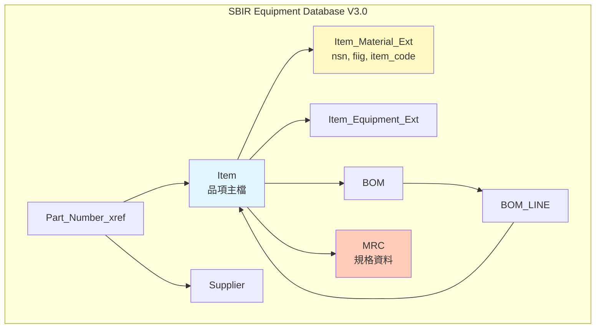
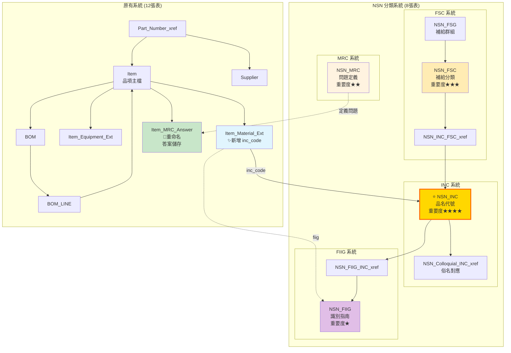
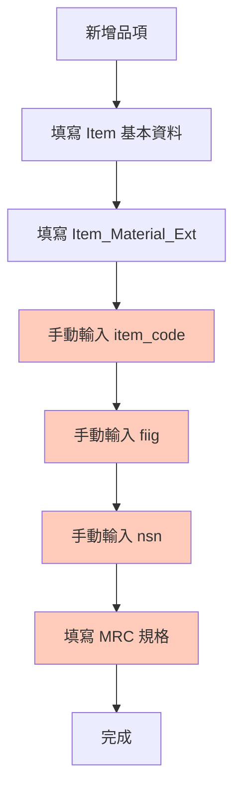
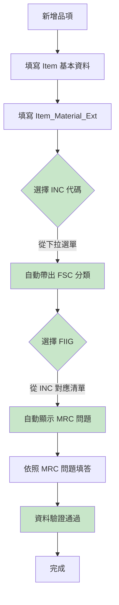

# NSN 整合架構對比

## 整合前 vs 整合後

### 表格數量對比

| 項目 | 整合前 | 整合後 | 變化 |
|------|--------|--------|------|
| **核心表格** | 12 張 | 20 張 | +8 張 |
| **視圖** | 0 個 | 6 個 | +6 個 |
| **函數** | 0 個 | 2 個 | +2 個 |

---

## 架構演進圖

### 整合前架構（V3.0）



**問題點：**
- ❌ NSN、FIIG、item_code 欄位無法驗證（沒有外鍵）
- ❌ 無 INC/FSC 分類系統
- ❌ MRC 僅儲存答案，無問題定義
- ❌ 無法追溯分類體系

---

### 整合後架構（V3.0 + NSN）



**改進點：**
- ✅ INC 品名代號標準化（最重要）
- ✅ FSC/FSG 分類體系完整
- ✅ FIIG 識別指南可追溯
- ✅ MRC 問題定義與答案分離
- ✅ 所有關鍵欄位有外鍵保護

---

## 功能對比

### 查詢功能

| 功能 | 整合前 | 整合後 |
|------|--------|--------|
| **依 INC 查詢品項** | ❌ 不支援 | ✅ `v_item_nsn_full` |
| **依 FSC 分類查詢** | ❌ 不支援 | ✅ `v_inc_classification` |
| **FIIG-INC 對應** | ❌ 手動查詢 | ✅ `v_fiig_inc_mapping` |
| **MRC 問答清單** | ⚠️ 僅有答案 | ✅ `v_item_mrc_qa` |
| **INC 模糊搜尋** | ❌ 不支援 | ✅ `fn_search_inc()` |
| **FSC 統計分析** | ❌ 不支援 | ✅ `v_fsc_statistics` |
| **BOM 含 NSN 資訊** | ⚠️ 僅有基本資訊 | ✅ `v_bom_nsn_detail` |

### 資料驗證

| 項目 | 整合前 | 整合後 |
|------|--------|--------|
| **NSN 格式驗證** | ❌ 無驗證 | ⚠️ 需手動啟用外鍵 |
| **FIIG 有效性** | ❌ 無驗證 | ✅ 外鍵約束 |
| **INC 有效性** | ❌ 無驗證 | ✅ 外鍵約束 |
| **MRC 問題定義** | ❌ 無定義 | ✅ NSN_MRC 表 |

---

## 資料流程對比

### 整合前：新增品項流程



**問題：** 所有代碼都是手動輸入，無法驗證正確性

---

### 整合後：新增品項流程



**改進：** 所有代碼都可從標準清單選擇，並有外鍵驗證

---

## 關鍵欄位演進

### Item_Material_Ext 欄位變化

| 欄位名稱 | 整合前 | 整合後 | 說明 |
|---------|--------|--------|------|
| `nsn` | VARCHAR(20) | VARCHAR(20) | 無變化，建議日後加外鍵 |
| `item_code` | VARCHAR(10) | VARCHAR(10) | 無變化，可能對應 INC |
| `fiig` | VARCHAR(10) | VARCHAR(10) | 可加外鍵到 NSN_FIIG |
| `inc_code` | ❌ 不存在 | ✅ VARCHAR(10) | **新增**，外鍵到 NSN_INC |

### MRC 表演進

| 表格名稱 | 整合前 | 整合後 |
|---------|--------|--------|
| `MRC` | 儲存規格答案 | ❌ 已重命名 |
| `Item_MRC_Answer` | ❌ 不存在 | ✅ 儲存答案（重命名自 MRC） |
| `NSN_MRC` | ❌ 不存在 | ✅ 儲存問題定義 |

**概念釐清：**
- **Item_MRC_Answer**: 每個品項的規格答案（實例資料）
- **NSN_MRC**: MRC 問題的定義（元數據）

---

## 使用案例對比

### 案例 1：查詢「電笛喇叭」的完整分類

#### 整合前
```sql
-- 只能查到基本資訊
SELECT
    item_code,
    item_name_zh,
    nsn,
    fiig,
    item_code  -- 不確定是否為 INC
FROM Item i
JOIN Item_Material_Ext im ON i.item_uuid = im.item_uuid
WHERE i.item_code = 'YETL23002';
```

**結果：** 得到代碼，但不知道代碼的意義

---

#### 整合後
```sql
-- 可查到完整分類資訊
SELECT * FROM v_item_nsn_full
WHERE item_code = 'YETL23002';
```

**結果：**
- INC 代碼 + INC 名稱
- FIIG 代碼 + FIIG 描述
- FSC 分類 + FSC 名稱
- FSG 群組 + FSG 名稱
- 所有 MRC 問答

---

### 案例 2：新增一個「電纜組件」品項

#### 整合前
```sql
-- 手動輸入所有代碼（容易出錯）
INSERT INTO Item_Material_Ext (
    item_uuid, inc_code, fiig, nsn, item_code
) VALUES (
    uuid_generate_v4(),
    '00009',  -- ❓ 不確定是否正確
    'A001A0', -- ❓ 不確定是否正確
    '5995-01-XXX-1234',
    'CABLE'   -- ❓ 可能與 inc_code 不一致
);
```

---

#### 整合後
```sql
-- 1. 先搜尋正確的 INC
SELECT * FROM fn_search_inc('cable');
-- 得到: inc_code='00009', short_name='CABLE'

-- 2. 查詢此 INC 的可用 FIIG
SELECT * FROM v_fiig_inc_mapping
WHERE inc_code = '00009';
-- 得到: fiig_code='A001A0'

-- 3. 新增品項（有外鍵保護）
INSERT INTO Item_Material_Ext (
    item_uuid, inc_code, fiig
) VALUES (
    uuid_generate_v4(),
    '00009',   -- ✅ 外鍵驗證
    'A001A0'   -- ✅ 外鍵驗證
);
```

---

## 整合效益總結

| 效益類別 | 具體改進 | 重要性 |
|---------|---------|--------|
| **資料品質** | 外鍵約束防止錯誤代碼 | ⭐⭐⭐⭐⭐ |
| **查詢效率** | 6個視圖簡化複雜查詢 | ⭐⭐⭐⭐ |
| **標準化** | 符合 NATO/NSN 標準 | ⭐⭐⭐⭐ |
| **可追溯性** | 完整分類體系 | ⭐⭐⭐⭐ |
| **使用者體驗** | 下拉選單取代手動輸入 | ⭐⭐⭐⭐ |
| **維護性** | 問題定義與答案分離 | ⭐⭐⭐ |

---

## 升級路徑

### 目前狀態：階段一（核心整合）✅

- ✅ INC 系統
- ✅ FSC/FSG 系統
- ✅ FIIG 系統
- ✅ MRC 問題定義

### 未來擴充：階段二（選配）

- ⏳ NATO H6 物品名稱系統
- ⏳ MRC 回應選項表（標準答案）
- ⏳ FIIG-INC-MRC 三元關係
- ⏳ 格式驗證系統

### 未來擴充：階段三（選配）

- ⏳ Web 申編單系統
- ⏳ 使用者權限管理
- ⏳ 申編流程追蹤

---

**文件版本：** v1.0
**建立日期：** 2025-11-24
**架構版本：** V3.0 + NSN Core Integration
