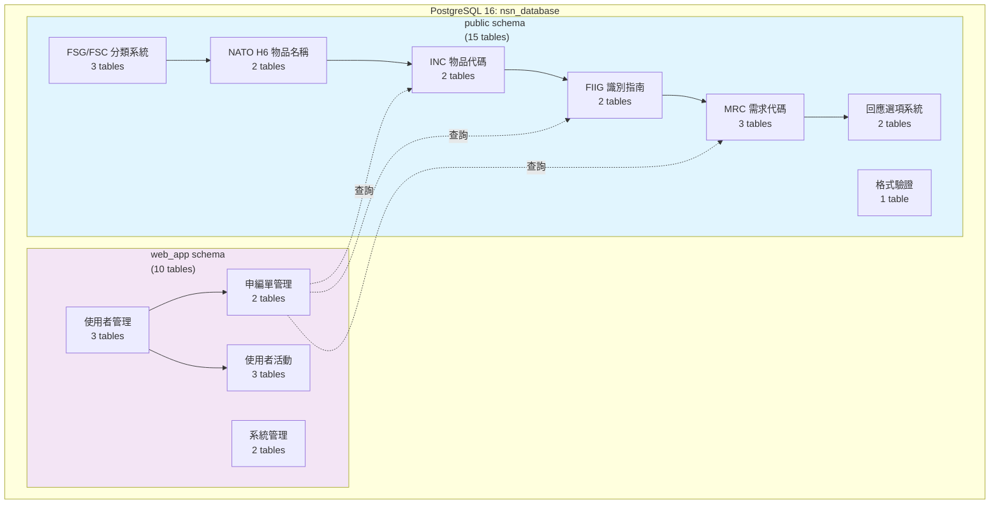
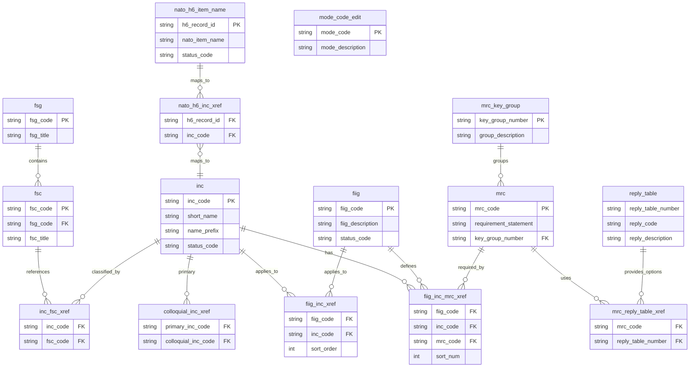
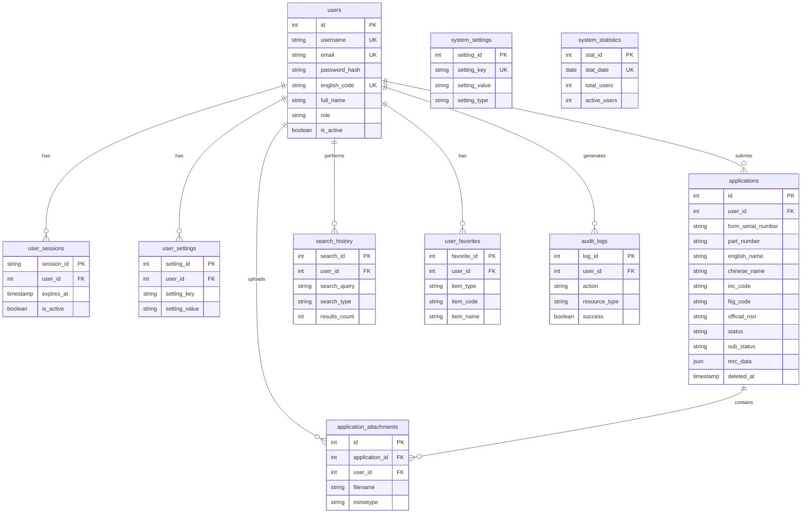
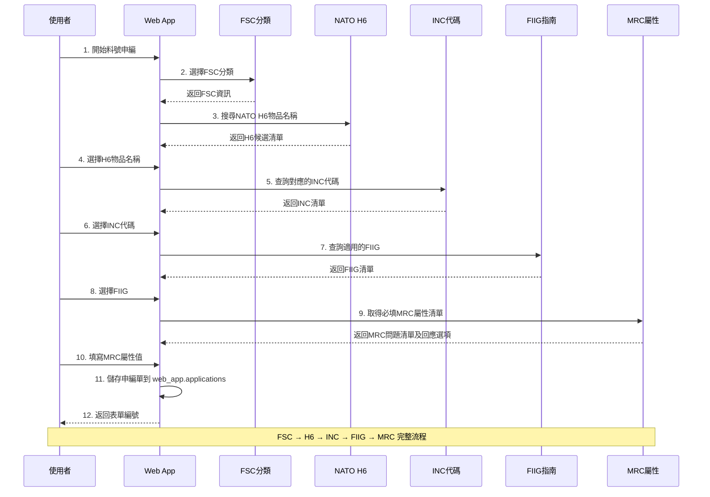
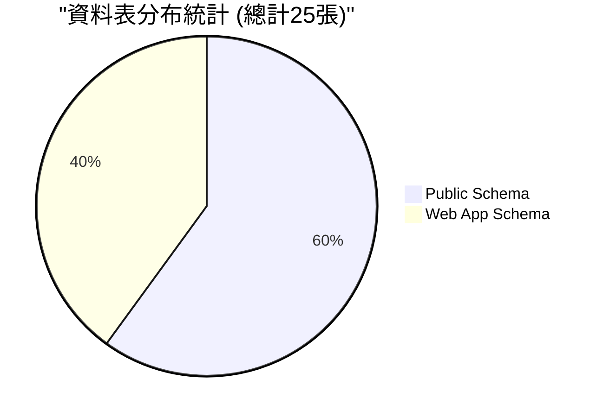
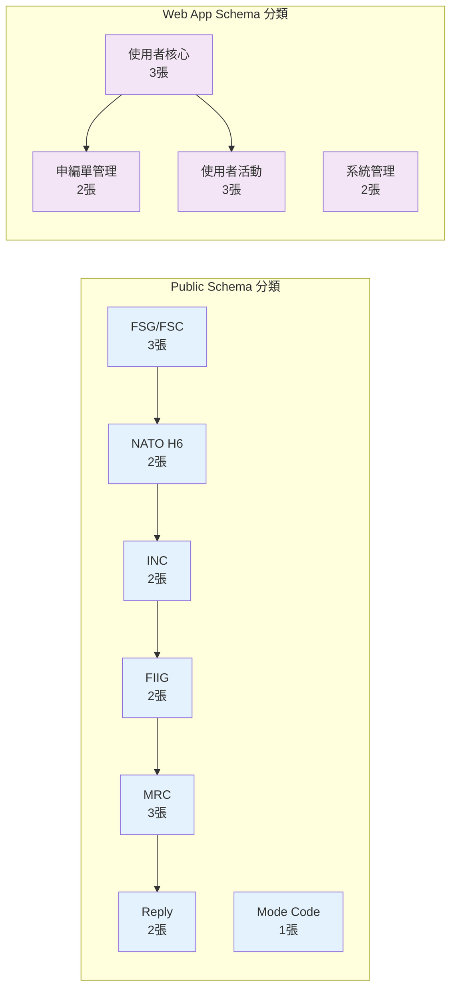
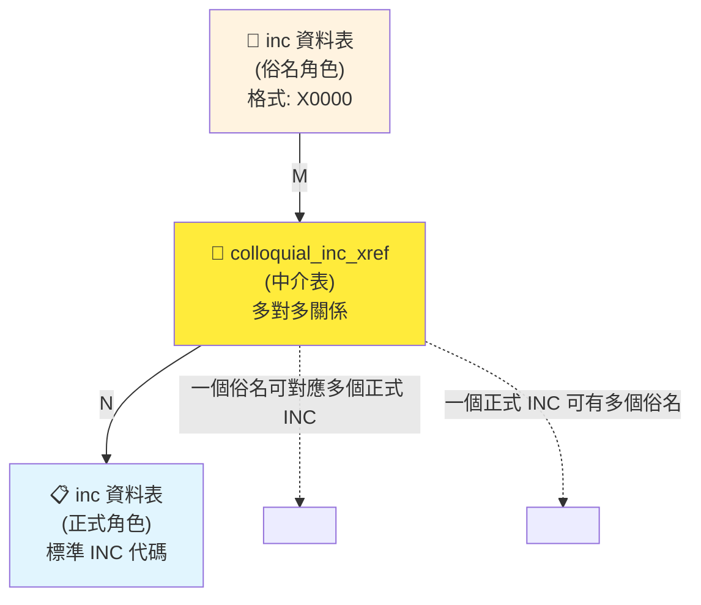
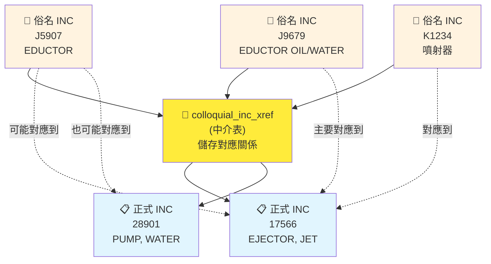
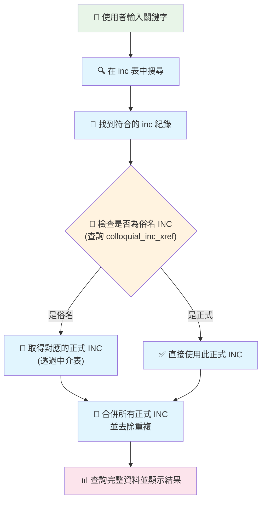
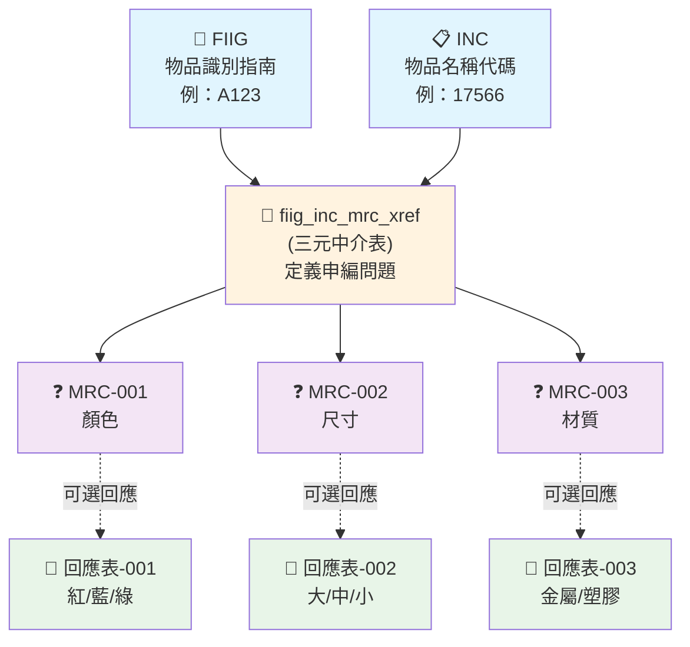

# 附件一：資料庫架構與建置指南

## 1. 系統架構

本系統採用「單一資料庫、雙 Schema」的架構，將核心業務數據與網頁應用數據分離，同時確保兩者可以高效協同運作。

- **資料庫**: `nsn_database` (PostgreSQL 16)
- **`public` schema**: 存放15張核心業務資料表，如 `fsc`, `inc`, `nato_h6_item_name` 等，負責處理料號申編的主要邏輯。
- **`web_app` schema**: 存放10張網頁應用程式相關的資料表，如 `users`, `applications`, `user_sessions`, `search_history` 等，負責處理使用者認證、會話管理與個人化功能。

### 1.1. 系統整體架構圖



### 1.2. Public Schema 資料庫實體關係圖 (ERD)



### 1.3. Web App Schema 資料庫實體關係圖 (ERD)



### 1.4. 核心表格 (Public Schema) - 15張表格

#### FSG/FSC 分類系統 (3張)
- `public.fsg` - 聯邦補給群組
- `public.fsc` - 聯邦補給分類
- `public.inc_fsc_xref` - INC與FSC對應關係

#### NATO H6 物品名稱系統 (2張)
- `public.nato_h6_item_name` - NATO H6物品名稱主檔
- `public.nato_h6_inc_xref` - H6與INC對應關係

#### INC 物品代碼系統 (2張)
- `public.inc` - 物品名稱代碼主檔
- `public.colloquial_inc_xref` - 俗稱INC對應正式INC

#### FIIG 識別指南系統 (2張)
- `public.fiig` - 物品識別指南主檔
- `public.fiig_inc_xref` - FIIG與INC對應關係

#### MRC 需求代碼系統 (3張)
- `public.mrc_key_group` - MRC分組
- `public.mrc` - 主需求代碼主檔
- `public.fiig_inc_mrc_xref` - FIIG-INC-MRC三元關聯

#### 回應選項系統 (2張)
- `public.reply_table` - 回應選項表
- `public.mrc_reply_table_xref` - MRC與回應表對應

#### 格式驗證 (1張)
- `public.mode_code_edit` - 模式代碼編輯與驗證

### 1.5. 網頁應用表格 (Web App Schema) - 10張表格

`web_app` schema 負責儲存所有與使用者互動、前端功能相關的資料。

#### 使用者核心 (3張)
- **`web_app.users`**: 儲存使用者帳號、個人資料與權限。
- **`web_app.user_sessions`**: 管理使用者登入狀態與會話。
- **`web_app.user_settings`**: 儲存使用者個人化設定。

#### 申編單管理 (2張)
- **`web_app.applications`**: 儲存使用者提交的料號申編單。此表格的關鍵欄位設計如下：
    - `id`: **系統唯一主鍵 (Primary Key)**，由資料庫自動產生，確保每筆申請單的絕對唯一性。
    - `form_serial_number`: 使用者可自訂的「表單編號」。系統會自動產生建議值，但使用者可修改。此欄位**允許重複**。
    - `official_nsn`: **預留欄位**，用於儲存申編成功後，由官方核發的正式料號。
    - `mrc_data`: JSON 欄位，用於儲存完整的 MRC 屬性回答清單。
    - `deleted_at`: 軟刪除時間戳記，支援申編單的軟刪除功能。
- **`web_app.application_attachments`**: 儲存申編單的附件（圖片、PDF等），透過 `application_id` 外鍵與主表關聯。

#### 使用者活動 (3張)
- **`web_app.search_history`**: 記錄使用者的搜尋歷史。
- **`web_app.user_favorites`**: 使用者收藏的料號項目（INC、FSC、FIIG等）。
- **`web_app.audit_logs`**: **【新增】** 系統操作日誌，記錄重要操作供審計追蹤。

#### 系統管理 (2張)
- **`web_app.system_settings`**: 全域系統設定。
- **`web_app.system_statistics`**: 每日系統使用統計資料。

## 2. 使用 Docker 快速建置

本專案採用 Docker 進行標準化部署，請遵循以下步驟完成環境設定。

### 2.1. 首次初始化 (新環境設定)

當您初次設定專案時，請依序執行以下指令來建立全新的開發環境：

**1. 啟動所有服務**
```bash
docker-compose up -d --build
```

**2. 建立 `public` schema 的表格結構**
```bash
docker-compose exec web python sql/setup_database.py
```

**3. 匯入 `public` schema 的核心資料**
```bash
docker-compose exec web python sql/data_import/import_database.py
```

**4. 建立 `web_app` schema**
```bash
docker-compose exec postgres psql -U postgres -d nsn_database -c "CREATE SCHEMA IF NOT EXISTS web_app;"
```

**5. 建立 `web_app` schema 的表格結構**
```bash
docker-compose exec web flask db upgrade
```

### 2.2. 資料庫結構變更 (日常開發)

當您需要對資料庫結構進行變更時（例如，在 `User` 模型中新增一個欄位），請遵循以下標準遷移流程：

**1. 產生遷移腳本**
```bash
docker-compose exec web flask db migrate -m "在這裡描述您的變更"
```

**2. 應用變更**
```bash
docker-compose exec web flask db upgrade
```

## 3. 資料轉換與匯入

若需從原始 DLA 文字檔重新匯入資料，請在 Docker 容器內執行轉換腳本。

**1. 執行資料轉換**
```bash
# 進入 web 服務容器
docker-compose exec web bash

# 執行所有轉換器
cd sql/txt_to_sql/
./execute_all_converters.sh
```

**2. 手動執行 SQL 匯入**
```bash
# 進入 postgres 服務容器
docker-compose exec postgres psql -U postgres -d nsn_database

# 在 psql 環境中執行 SQL 文件
\i /path/to/your/generated.sql
```

## 4. 料號申編流程驗證 (SQL範例)

### 4.1. 申編流程 Mermaid 圖解



### 4.2. SQL 查詢範例

以下 SQL 查詢已更新，以符合 `public` schema 架構。

#### H6 - NATO H6物品名稱查詢
```sql
SELECT h6_record_id, nato_item_name, english_description, status_code
FROM public.nato_h6_item_name
WHERE nato_item_name ILIKE '%cable%'
  AND status_code = 'A'
ORDER BY nato_item_name;
```

#### H6→INC - 物品名稱代碼對應
```sql
SELECT h.nato_item_name, i.inc_code,
       COALESCE(i.short_name, '') || ' ' ||
       COALESCE(i.name_prefix, '') || ' ' ||
       COALESCE(i.name_root_remainder, '') as inc_full_name,
       i.item_name_definition
FROM public.nato_h6_item_name h
JOIN public.nato_h6_inc_xref x ON h.h6_record_id = x.h6_record_id
JOIN public.inc i ON x.inc_code = i.inc_code
WHERE h.h6_record_id = 'G0001'
  AND i.status_code = 'A';
```

#### INC→FIIG - 識別指南查詢
```sql
SELECT i.inc_code, f.fiig_code, f.fiig_description, x.sort_order
FROM public.inc i
JOIN public.fiig_inc_xref x ON i.inc_code = x.inc_code
JOIN public.fiig f ON x.fiig_code = f.fiig_code
WHERE i.inc_code = '00009'
  AND f.status_code = 'A'
ORDER BY x.sort_order;
```

#### FIIG+INC→MRC - 需要填寫的屬性
```sql
SELECT fim.fiig_code, fim.inc_code, fim.mrc_code,
       m.requirement_statement as mrc_question,
       m.data_type, m.is_required,
       fim.sort_num,
       fim.tech_requirement_indicator,
       fim.multiple_value_indicator
FROM public.fiig_inc_mrc_xref fim
JOIN public.mrc m ON fim.mrc_code = m.mrc_code
WHERE fim.fiig_code = 'A001A0' AND fim.inc_code = '00009'
ORDER BY fim.sort_num;
```

#### MRC回應選項查詢
```sql
SELECT m.mrc_code, m.requirement_statement,
       rt.reply_table_number, rt.reply_code, rt.reply_description,
       rt.sort_order
FROM public.mrc m
JOIN public.mrc_reply_table_xref x ON m.mrc_code = x.mrc_code
JOIN public.reply_table rt ON x.reply_table_number = rt.reply_table_number
WHERE m.mrc_code = 'AAPE'
  AND rt.status_code = 'A'
ORDER BY rt.sort_order;
```

#### 完整申編流程查詢（從FSC到MRC）
```sql
-- 完整的申編流程查詢範例
SELECT
    fsc.fsc_code,
    fsc.fsc_title,
    i.inc_code,
    COALESCE(i.short_name, '') || ' ' ||
    COALESCE(i.name_prefix, '') || ' ' ||
    COALESCE(i.name_root_remainder, '') as inc_name,
    f.fiig_code,
    f.fiig_description,
    m.mrc_code,
    m.requirement_statement as mrc_question,
    fim.tech_requirement_indicator,
    fim.sort_num
FROM public.fsc fsc
JOIN public.inc_fsc_xref ifx ON fsc.fsc_code = ifx.fsc_code
JOIN public.inc i ON ifx.inc_code = i.inc_code
JOIN public.fiig_inc_xref fix ON i.inc_code = fix.inc_code
JOIN public.fiig f ON fix.fiig_code = f.fiig_code
JOIN public.fiig_inc_mrc_xref fim ON f.fiig_code = fim.fiig_code AND i.inc_code = fim.inc_code
JOIN public.mrc m ON fim.mrc_code = m.mrc_code
WHERE fsc.fsc_code = '5995'  -- 例如：電纜組件
  AND i.status_code = 'A'
  AND f.status_code = 'A'
ORDER BY fim.sort_num;
```
---

## 5. 資料表統計總覽





---

## 6. INC 俗名關係詳細圖解

### 6.1. INC 與俗名關係圖

這個圖表展示了正式 INC 與俗名 INC 之間的關係，透過中介表 `colloquial_inc_xref` 進行連接。



**關係說明**：
- **inc 資料表**: 同時儲存正式 INC 和俗名 INC
- **colloquial_inc_xref**: 中介表，建立俗名與正式 INC 的對應關係
- **關係類型**: 多對多 (M:N) - 一個俗名可對應多個正式 INC，一個正式 INC 也可有多個俗名

### 6.2. 多對多關係實例圖

這個圖表用具體的資料範例展示多對多關係：



**多對多關係特點**：
1. **一個俗名 → 多個正式**: 例如 "EDUCTOR" 可能同時對應到 "EJECTOR" 和 "PUMP"
2. **多個俗名 → 一個正式**: 例如 "EDUCTOR", "噴射器" 都可能指向同一個正式 INC
3. **靈活性**: 中介表允許複雜的語義對應關係
4. **可擴展性**: 新增俗名或正式 INC 都很容易

### 6.3. 核心搜尋流程圖

這個圖表展示了系統如何處理使用者搜尋，特別是俗名到正式 INC 的轉換過程。



### 6.4. FIIG-INC-MRC 三元關係圖

這個圖表專門展示申編流程中最重要的三元關係：哪個 FIIG 下的哪個 INC 需要回答哪些 MRC。



---

## 7. 圖表使用說明

### 符號說明
- 📋 **主要資料表**: 核心業務實體
- 🔗 **中介表**: 建立表格間關係的橋樑
- ❓ **問題表**: 申編時需要回答的問題
- 💬 **選項表**: 問題的標準化回答選項

### 顏色編碼
- **藍色**: 主要資料表
- **橙色**: 中介表 (橋樑作用)
- **紫色**: 問題/需求相關表格
- **綠色**: 回應/選項相關表格

### 閱讀建議
1. 先理解主要實體 (方形框)
2. 注意中介表的橋樑作用 (橙色框)
3. 跟隨箭頭理解資料流向
4. 重點關注三元關係 (FIIG-INC-MRC)

---

**文檔版本**: v5.2 (Added detailed relationship diagrams)
**架構類型**: 雙 Schema (public & web_app)
**支援資料庫**: PostgreSQL 16
**更新日期**: 2025-01-10
**狀態**: 生產就緒 ✅
**圖表工具**: Mermaid Diagrams
