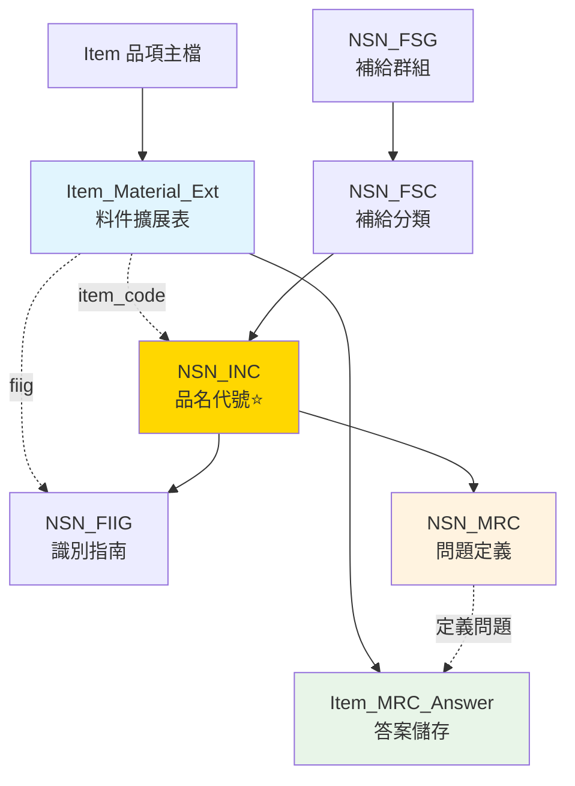

# NSN 料號申編系統整合方案

## 1. 整合策略總覽

### 1.1 設計原則
- **最小侵入性**：盡量保留現有架構，避免大幅重構
- **漸進式整合**：先整合核心功能，再擴展完整功能
- **資料重用**：利用現有欄位（nsn, fiig, item_code）
- **職責分離**：問題定義（NSN MRC）vs. 答案儲存（現有 MRC）

### 1.2 核心概念對應

| NSN 概念 | 重要性 | 現有欄位/表格 | 整合方式 |
|---------|--------|--------------|---------|
| **INC** (品名代號) | ⭐⭐⭐⭐ | `Item_Material_Ext.item_code` | 新增 INC 主檔 + 關聯表 |
| **FSC** (海軍大分類) | ⭐⭐⭐ | 無 | 新增 FSC/FSG 表 |
| **MRC** (需求代碼) | ⭐⭐ | `MRC` 表（但用途不同） | 新增 MRC 問題庫，保留現有 MRC |
| **FIIG** (識別指南) | ⭐ | `Item_Material_Ext.fiig` | 新增 FIIG 主檔 |

---

## 2. 階段一：核心表格整合（推薦）

### 2.1 新增 8 張核心表格

#### **INC 物品代碼系統（2張）**
```sql
-- INC 主檔
CREATE TABLE NSN_INC (
    inc_code VARCHAR(10) PRIMARY KEY,
    short_name VARCHAR(50),
    name_prefix VARCHAR(50),
    name_root_remainder VARCHAR(100),
    item_name_definition TEXT,
    status_code VARCHAR(2) DEFAULT 'A' CHECK (status_code IN ('A', 'I')),
    date_created TIMESTAMP DEFAULT CURRENT_TIMESTAMP,
    date_updated TIMESTAMP DEFAULT CURRENT_TIMESTAMP
);

COMMENT ON TABLE NSN_INC IS 'INC 物品名稱代碼主檔（NSN系統）';
COMMENT ON COLUMN NSN_INC.inc_code IS 'INC代碼（例：00009）';
COMMENT ON COLUMN NSN_INC.status_code IS '狀態：A=Active, I=Inactive';

-- INC 與 Item 關聯
-- 方式1：直接使用 Item_Material_Ext.item_code 關聯
ALTER TABLE Item_Material_Ext
    ADD CONSTRAINT fk_item_material_inc
    FOREIGN KEY (item_code) REFERENCES NSN_INC(inc_code);

-- 方式2：若 item_code 用途不同，新增專用欄位
ALTER TABLE Item_Material_Ext
    ADD COLUMN inc_code VARCHAR(10);
```

#### **FSC/FSG 分類系統（3張）**
```sql
-- FSG 主檔
CREATE TABLE NSN_FSG (
    fsg_code VARCHAR(2) PRIMARY KEY,
    fsg_title VARCHAR(200),
    date_created TIMESTAMP DEFAULT CURRENT_TIMESTAMP
);

COMMENT ON TABLE NSN_FSG IS 'FSG 聯邦補給群組（NSN系統）';

-- FSC 主檔
CREATE TABLE NSN_FSC (
    fsc_code VARCHAR(4) PRIMARY KEY,
    fsg_code VARCHAR(2),
    fsc_title VARCHAR(200),
    date_created TIMESTAMP DEFAULT CURRENT_TIMESTAMP,
    FOREIGN KEY (fsg_code) REFERENCES NSN_FSG(fsg_code)
);

COMMENT ON TABLE NSN_FSC IS 'FSC 聯邦補給分類（NSN系統）';
COMMENT ON COLUMN NSN_FSC.fsc_code IS 'FSC代碼（4位數，例：5995）';

-- INC-FSC 對應表
CREATE TABLE NSN_INC_FSC_xref (
    inc_code VARCHAR(10),
    fsc_code VARCHAR(4),
    date_created TIMESTAMP DEFAULT CURRENT_TIMESTAMP,
    PRIMARY KEY (inc_code, fsc_code),
    FOREIGN KEY (inc_code) REFERENCES NSN_INC(inc_code),
    FOREIGN KEY (fsc_code) REFERENCES NSN_FSC(fsc_code)
);

COMMENT ON TABLE NSN_INC_FSC_xref IS 'INC與FSC對應關係';
```

#### **FIIG 識別指南系統（2張）**
```sql
-- FIIG 主檔
CREATE TABLE NSN_FIIG (
    fiig_code VARCHAR(10) PRIMARY KEY,
    fiig_description TEXT,
    status_code VARCHAR(2) DEFAULT 'A',
    date_created TIMESTAMP DEFAULT CURRENT_TIMESTAMP
);

COMMENT ON TABLE NSN_FIIG IS 'FIIG 物品識別指南主檔（NSN系統）';

-- FIIG-INC 對應表
CREATE TABLE NSN_FIIG_INC_xref (
    fiig_code VARCHAR(10),
    inc_code VARCHAR(10),
    sort_order INT,
    date_created TIMESTAMP DEFAULT CURRENT_TIMESTAMP,
    PRIMARY KEY (fiig_code, inc_code),
    FOREIGN KEY (fiig_code) REFERENCES NSN_FIIG(fiig_code),
    FOREIGN KEY (inc_code) REFERENCES NSN_INC(inc_code)
);

COMMENT ON TABLE NSN_FIIG_INC_xref IS 'FIIG與INC對應關係';
```

#### **MRC 需求代碼系統（1張核心表，重命名現有 MRC）**
```sql
-- ⚠️ 先重命名現有的 MRC 表
ALTER TABLE MRC RENAME TO Item_MRC_Answer;

COMMENT ON TABLE Item_MRC_Answer IS '品項MRC答案表（儲存已填寫的規格答案）';

-- 新增 NSN MRC 問題定義表
CREATE TABLE NSN_MRC (
    mrc_code VARCHAR(10) PRIMARY KEY,
    requirement_statement TEXT,
    data_type VARCHAR(20),
    is_required BOOLEAN DEFAULT TRUE,
    date_created TIMESTAMP DEFAULT CURRENT_TIMESTAMP
);

COMMENT ON TABLE NSN_MRC IS 'MRC 需求代碼主檔（問題定義）';
COMMENT ON COLUMN NSN_MRC.requirement_statement IS 'MRC問題陳述（例：請輸入電壓）';
COMMENT ON COLUMN NSN_MRC.data_type IS '資料類型（TEXT/NUMBER/SELECT等）';
```

### 2.2 資料關係圖



---

## 3. 階段二：完整 NSN 系統（選配）

若需要完整的 NSN 料號申編功能，可再新增：

### 3.1 額外表格（+9張）

```sql
-- NATO H6 物品名稱系統（2張）
CREATE TABLE NSN_NATO_H6_Item_Name (...);
CREATE TABLE NSN_NATO_H6_INC_xref (...);

-- MRC 完整系統（4張）
CREATE TABLE NSN_MRC_Key_Group (...);        -- MRC 分組
CREATE TABLE NSN_FIIG_INC_MRC_xref (...);    -- 三元關係
CREATE TABLE NSN_Reply_Table (...);          -- 標準答案選項
CREATE TABLE NSN_MRC_Reply_Table_xref (...); -- MRC-答案對應

-- 其他輔助（3張）
CREATE TABLE NSN_Colloquial_INC_xref (...);  -- 俗名對應
CREATE TABLE NSN_Mode_Code_Edit (...);       -- 格式驗證
CREATE TABLE NSN_Application_Form (...);     -- 申編單
```

---

## 4. 整合後的查詢範例

### 4.1 透過 INC 查詢品項
```sql
-- 查詢使用特定 INC 的所有品項
SELECT
    i.item_code,
    i.item_name_zh,
    i.item_name_en,
    im.nsn,
    im.fiig,
    inc.inc_code,
    inc.short_name AS inc_name
FROM Item i
JOIN Item_Material_Ext im ON i.item_uuid = im.item_uuid
JOIN NSN_INC inc ON im.item_code = inc.inc_code
WHERE inc.inc_code = '00009';
```

### 4.2 查詢品項的 MRC 問題與答案
```sql
-- 查詢某品項需要填寫的 MRC 問題及已填答案
SELECT
    i.item_name_zh,
    mrc_q.mrc_code,
    mrc_q.requirement_statement AS question,
    mrc_a.answer_zh AS answer,
    mrc_a.spec_no AS answer_order
FROM Item i
JOIN Item_Material_Ext im ON i.item_uuid = im.item_uuid
JOIN NSN_INC inc ON im.item_code = inc.inc_code
LEFT JOIN NSN_MRC mrc_q ON TRUE  -- 可根據 FIIG+INC 組合查詢
LEFT JOIN Item_MRC_Answer mrc_a ON i.item_uuid = mrc_a.item_uuid
    AND mrc_a.spec_abbr = mrc_q.mrc_code
WHERE i.item_uuid = 'a0000001-0000-0000-0000-000000000003';
```

### 4.3 透過 FSC 分類查詢
```sql
-- 查詢屬於特定 FSC 的所有 INC 和品項
SELECT
    fsc.fsc_code,
    fsc.fsc_title,
    inc.inc_code,
    inc.short_name,
    COUNT(i.item_uuid) AS item_count
FROM NSN_FSC fsc
JOIN NSN_INC_FSC_xref xref ON fsc.fsc_code = xref.fsc_code
JOIN NSN_INC inc ON xref.inc_code = inc.inc_code
LEFT JOIN Item_Material_Ext im ON inc.inc_code = im.item_code
LEFT JOIN Item i ON im.item_uuid = i.item_uuid
WHERE fsc.fsc_code = '6350'
GROUP BY fsc.fsc_code, fsc.fsc_title, inc.inc_code, inc.short_name;
```

---

## 5. 實施建議

### 5.1 優先級

| 階段 | 內容 | 表格數 | 工作量 | 效益 |
|-----|------|--------|--------|------|
| **第一階段** | 核心整合（INC + FSC + FIIG） | +8 張 | 1-2 天 | ⭐⭐⭐⭐ |
| **第二階段** | MRC 問題庫系統 | +4 張 | 2-3 天 | ⭐⭐⭐ |
| **第三階段** | 完整 NSN 申編流程 | +9 張 | 5-7 天 | ⭐⭐ |

### 5.2 資料來源

需要準備的資料檔案：
1. **INC 主檔** - 品名代號清單（最重要）
2. **FSC/FSG** - 海軍分類代碼
3. **FIIG** - 識別指南代碼
4. **MRC** - 需求代碼問題定義

### 5.3 相容性考量

- ✅ 現有 `Item_Material_Ext.item_code` 可直接對應 INC
- ✅ 現有 `Item_Material_Ext.fiig` 可外鍵連結到 `NSN_FIIG`
- ✅ 現有 `MRC` 表重命名後繼續使用
- ⚠️ 需確認 `item_code` 欄位目前的使用方式是否與 INC 一致

---

## 6. 下一步行動

### 選項 A：快速整合（推薦）
```bash
# 1. 執行核心表格建立腳本
psql -U postgres -d sbir_equipment_db_v2 -f create_nsn_core_tables.sql

# 2. 匯入 NSN 基礎資料
python import_nsn_data.py --tables inc,fsc,fiig

# 3. 驗證整合
psql -U postgres -d sbir_equipment_db_v2 -f validate_nsn_integration.sql
```

### 選項 B：完整整合
參考 `00-architecture.md` 中的 NSN 完整架構

---

## 7. 潛在問題與解決方案

| 問題 | 解決方案 |
|------|---------|
| `item_code` 欄位已有其他用途 | 新增 `inc_code` 專用欄位 |
| NSN 資料量龐大 | 僅匯入常用的 INC/FSC，按需擴充 |
| 現有 MRC 資料遷移 | 提供遷移腳本，將 `spec_abbr` 對應到 `NSN_MRC.mrc_code` |
| FIIG 欄位格式不一致 | 新增資料清洗腳本 |

---

**文件版本**: v1.0
**建立日期**: 2025-11-24
**建議實施**: 階段一（核心整合）
**預計效益**: 讓現有品項具備標準化的 NSN 分類能力
