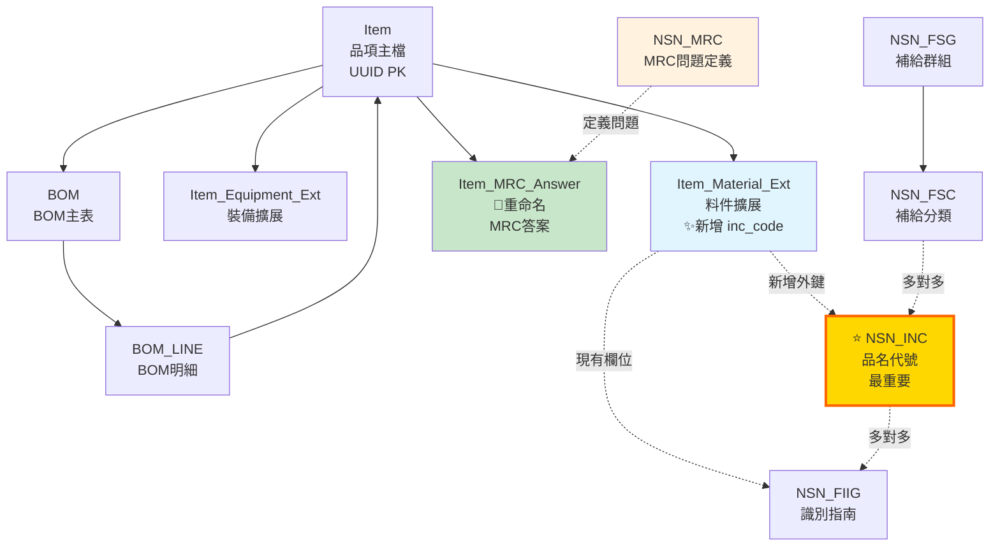

# NSN 系統整合執行指南

## 快速開始

### 前置需求
- PostgreSQL 16 已安裝
- sbir_equipment_db_v2 資料庫已建立
- 擁有資料庫管理員權限

---

## 整合步驟

### 步驟 1：執行核心整合腳本

```bash
# Windows 環境
PGPASSWORD=willlin07 "/c/Program Files/PostgreSQL/16/bin/psql.exe" ^
  -U postgres -h localhost -p 5432 ^
  -f "c:/github/SBIR/Database/scripts/integrate_nsn_core.sql"
```

**此腳本會：**
- ✅ 將現有的 `MRC` 表重命名為 `Item_MRC_Answer`
- ✅ 建立 8 張新的 NSN 表格
- ✅ 在 `Item_Material_Ext` 新增 `inc_code` 欄位
- ✅ 建立所有必要的外鍵約束
- ✅ 插入測試資料

**預計執行時間：** < 10 秒

---

### 步驟 2：驗證整合結果

```bash
PGPASSWORD=willlin07 "/c/Program Files/PostgreSQL/16/bin/psql.exe" ^
  -U postgres -h localhost -p 5432 ^
  -f "c:/github/SBIR/Database/scripts/validate_nsn_integration.sql"
```

**驗證項目：**
- 檢查 8 張 NSN 表格是否建立
- 檢查外鍵關聯是否正確
- 測試基本查詢（INC → FSC → FSG）
- 檢查測試資料是否正確插入

**預計執行時間：** < 5 秒

---

### 步驟 3：建立實用視圖與函數

```bash
PGPASSWORD=willlin07 "/c/Program Files/PostgreSQL/16/bin/psql.exe" ^
  -U postgres -h localhost -p 5432 ^
  -f "c:/github/SBIR/Database/scripts/create_nsn_views.sql"
```

**建立內容：**
- 6 個實用視圖（簡化常用查詢）
- 2 個搜尋函數

**預計執行時間：** < 5 秒

---

## 整合後的資料庫架構

### 表格總覽（20張表）

| 類別 | 表格數 | 表格清單 |
|------|--------|---------|
| **原有核心表** | 12 | Item, Item_Equipment_Ext, Item_Material_Ext, Supplier, BOM, BOM_LINE, Item_MRC_Answer, Part_Number_xref, TechnicalDocument, Item_Document_xref, ApplicationForm, ApplicationFormDetail |
| **NSN 核心表** | 8 | NSN_INC, NSN_Colloquial_INC_xref, NSN_FSG, NSN_FSC, NSN_INC_FSC_xref, NSN_FIIG, NSN_FIIG_INC_xref, NSN_MRC |

### 關聯圖



---

## 使用範例

### 查詢 1：查看所有品項的 NSN 分類

```sql
SELECT * FROM v_item_nsn_full
WHERE inc_code IS NOT NULL
ORDER BY item_code;
```

### 查詢 2：搜尋 INC（模糊比對）

```sql
-- 搜尋包含 "cable" 的 INC
SELECT * FROM fn_search_inc('cable');

-- 搜尋包含 "pump" 的 INC
SELECT * FROM fn_search_inc('pump');
```

### 查詢 3：查看 FSC 分類統計

```sql
SELECT
    fsg_code,
    fsg_title_zh,
    fsc_code,
    fsc_title_zh,
    inc_count,
    item_count
FROM v_fsc_statistics
ORDER BY fsg_code, fsc_code;
```

### 查詢 4：查看品項的 MRC 問答

```sql
-- 查看電笛喇叭的 MRC 問答
SELECT * FROM v_item_mrc_qa
WHERE item_code = 'YETL23002';

-- 使用函數查詢
SELECT * FROM fn_get_item_mrc_questions('a0000001-0000-0000-0000-000000000003');
```

### 查詢 5：查看 BOM 結構（含 NSN 分類）

```sql
SELECT
    bom_code,
    parent_item_name,
    line_no,
    component_name,
    component_inc,
    component_inc_name,
    qty_per
FROM v_bom_nsn_detail
WHERE bom_code = 'BOM-MAIN-001'
ORDER BY line_no;
```

---

## 資料更新

### 為現有品項設定 INC 代碼

```sql
-- 方法1：手動更新單筆
UPDATE Item_Material_Ext
SET inc_code = '00009'
WHERE item_uuid = 'a0000001-0000-0000-0000-000000000003';

-- 方法2：批次更新（根據 item_code 欄位）
UPDATE Item_Material_Ext im
SET inc_code = nsn_inc.inc_code
FROM NSN_INC nsn_inc
WHERE im.item_code = nsn_inc.inc_code;

-- 方法3：使用中文品名模糊比對（需人工審核）
SELECT
    i.item_code,
    i.item_name_zh,
    inc.inc_code,
    inc.short_name AS suggested_inc
FROM Item i
JOIN Item_Material_Ext im ON i.item_uuid = im.item_uuid
CROSS JOIN NSN_INC inc
WHERE im.inc_code IS NULL
AND (
    i.item_name_zh ILIKE '%' || inc.short_name || '%'
    OR inc.short_name ILIKE '%' || i.item_name_zh || '%'
)
LIMIT 50;
```

### 新增 INC 資料

```sql
INSERT INTO NSN_INC (
    inc_code,
    short_name,
    item_name_definition,
    status_code
) VALUES (
    '12345',
    'WIDGET',
    'ELECTRONIC WIDGET ASSEMBLY',
    'A'
);
```

### 新增 MRC 問題定義

```sql
INSERT INTO NSN_MRC (
    mrc_code,
    requirement_statement,
    requirement_statement_zh,
    data_type,
    is_required
) VALUES (
    'DIMN',
    'DIMENSION',
    '尺寸',
    'TEXT',
    TRUE
);
```

### 為品項新增 MRC 答案

```sql
INSERT INTO Item_MRC_Answer (
    item_uuid,
    spec_no,
    spec_abbr,
    spec_en,
    spec_zh,
    answer_en,
    answer_zh
) VALUES (
    'a0000001-0000-0000-0000-000000000003',
    3,
    'DIMN',
    'DIMENSION',
    '尺寸',
    '10cm x 5cm x 3cm',
    '10公分 x 5公分 x 3公分'
);
```

---

## 進階功能（選配）

若需要完整的 NSN 料號申編功能，可進一步整合：

### 階段 2：MRC 完整系統

```sql
-- 新增 MRC 分組
CREATE TABLE NSN_MRC_Key_Group (...);

-- 新增 FIIG-INC-MRC 三元關係
CREATE TABLE NSN_FIIG_INC_MRC_xref (...);

-- 新增回應選項表
CREATE TABLE NSN_Reply_Table (...);
CREATE TABLE NSN_MRC_Reply_Table_xref (...);
```

### 階段 3：NATO H6 系統

```sql
-- NATO H6 物品名稱
CREATE TABLE NSN_NATO_H6_Item_Name (...);
CREATE TABLE NSN_NATO_H6_INC_xref (...);
```

參考：[Database/docs/00-architecture.md](../docs/00-architecture.md) 中的完整 NSN 架構

---

## 疑難排解

### 問題 1：腳本執行失敗

**錯誤訊息：** `relation "mrc" does not exist`

**解決方案：** 可能已經執行過整合腳本，MRC 表已重命名。檢查是否存在 `Item_MRC_Answer` 表：

```sql
SELECT tablename FROM pg_tables WHERE tablename LIKE '%mrc%';
```

### 問題 2：外鍵約束違反

**錯誤訊息：** `violates foreign key constraint`

**解決方案：** 檢查 `Item_Material_Ext.inc_code` 的值是否都存在於 `NSN_INC.inc_code`：

```sql
SELECT DISTINCT inc_code
FROM Item_Material_Ext
WHERE inc_code IS NOT NULL
AND inc_code NOT IN (SELECT inc_code FROM NSN_INC);
```

### 問題 3：視圖查詢緩慢

**原因：** 視圖涉及多表關聯

**解決方案：** 確認索引已建立：

```sql
-- 檢查索引
SELECT
    tablename,
    indexname
FROM pg_indexes
WHERE tablename LIKE 'nsn_%'
ORDER BY tablename, indexname;
```

---

## 回滾指令（如需還原）

若整合失敗或需要還原，可執行以下指令：

```sql
-- 連接資料庫
\c sbir_equipment_db_v2;

-- 1. 刪除視圖
DROP VIEW IF EXISTS v_item_nsn_full CASCADE;
DROP VIEW IF EXISTS v_inc_classification CASCADE;
DROP VIEW IF EXISTS v_fiig_inc_mapping CASCADE;
DROP VIEW IF EXISTS v_item_mrc_qa CASCADE;
DROP VIEW IF EXISTS v_fsc_statistics CASCADE;
DROP VIEW IF EXISTS v_bom_nsn_detail CASCADE;

-- 2. 刪除函數
DROP FUNCTION IF EXISTS fn_search_inc(TEXT);
DROP FUNCTION IF EXISTS fn_get_item_mrc_questions(UUID);

-- 3. 刪除 NSN 表格
DROP TABLE IF EXISTS NSN_INC_FSC_xref CASCADE;
DROP TABLE IF EXISTS NSN_FIIG_INC_xref CASCADE;
DROP TABLE IF EXISTS NSN_Colloquial_INC_xref CASCADE;
DROP TABLE IF EXISTS NSN_FSC CASCADE;
DROP TABLE IF EXISTS NSN_FSG CASCADE;
DROP TABLE IF EXISTS NSN_INC CASCADE;
DROP TABLE IF EXISTS NSN_FIIG CASCADE;
DROP TABLE IF EXISTS NSN_MRC CASCADE;

-- 4. 還原 MRC 表名稱
ALTER TABLE Item_MRC_Answer RENAME TO MRC;

-- 5. 移除新增欄位
ALTER TABLE Item_Material_Ext DROP COLUMN IF EXISTS inc_code;

-- 完成
SELECT 'NSN 整合已回滾' AS result;
```

---

## 聯絡資訊

- **專案路徑：** `c:\github\SBIR\`
- **文檔位置：** `Database/docs/`
- **腳本位置：** `Database/scripts/`

---

**文件版本：** v1.0
**建立日期：** 2025-11-24
**最後更新：** 2025-11-24
**狀態：** 已測試 ✅
