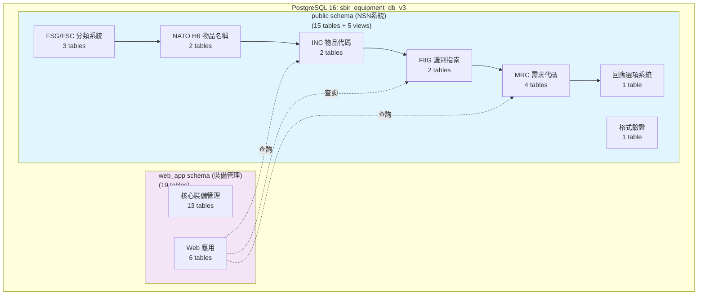
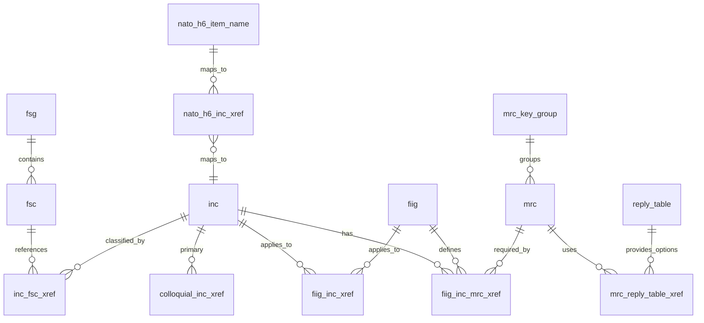
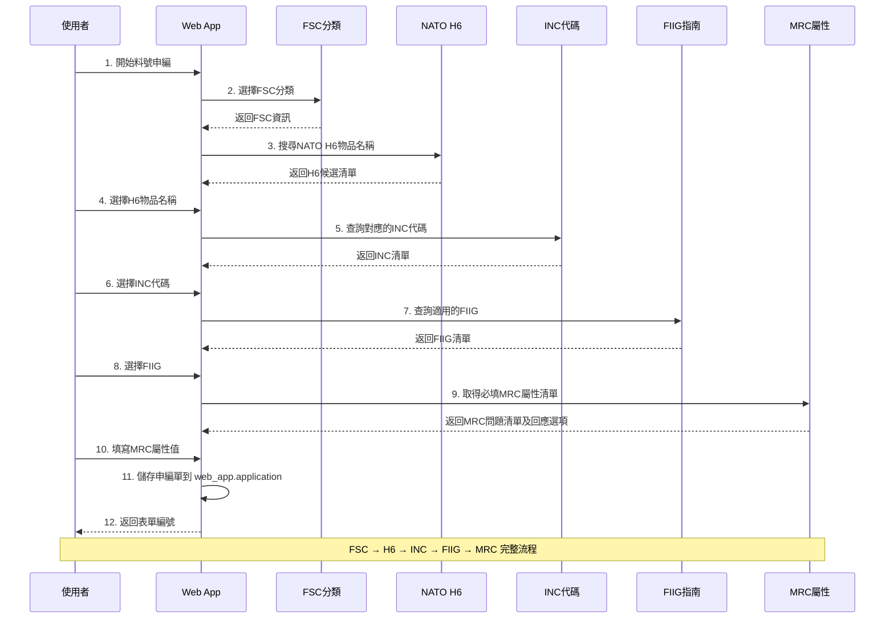
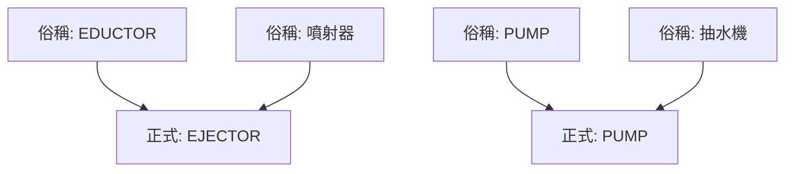

# NSN 系統架構說明

## 1. 系統概述

NSN（NATO Stock Number）料號申編系統是海軍裝備管理的核心系統，用於管理物品名稱代碼（INC）、聯邦補給分類（FSC/FSG）、物品識別指南（FIIG）及物料需求代碼（MRC）等資料。

### 1.1 系統特點
- **完整性**: 涵蓋 FSC→H6→INC→FIIG→MRC 完整流程
- **可追溯性**: 完整的分類體系與資料關聯
- **多對多關係**: 支援俗語 INC 對應、FIIG-INC-MRC 三元關係

## 2. 資料來源
- **路徑**: `Database/data/海軍/`
- **格式**: 文字檔 (.txt) / Excel (.xlsx)
- **資料來源**: DLA (Defense Logistics Agency)
- **資料量**: 超過 500,000 筆記錄

## 3. 資料庫架構

本系統採用「單一資料庫、雙 Schema」的架構，將核心業務數據與網頁應用數據分離。

- **資料庫**: `sbir_equipment_db_v3` (PostgreSQL 16)
- **`public` schema**: 存放 **15 張** NSN 核心業務資料表 + **5 個查詢視圖**
- **`web_app` schema`: 存放 **19 張**資料表（13核心裝備管理 + 6 Web應用）

### 3.1 系統整體架構圖



### 3.2 Public Schema - NSN 系統（15 個表格）

#### FSG/FSC 分類系統（3 個表格）
| 表格 | 說明 | 記錄數 | 資料大小 |
|------|------|--------|----------|
| `fsg` | 聯邦補給群組（Federal Supply Group） | 80 | 32 KB |
| `fsc` | 聯邦補給分類（Federal Supply Class） | 676 | 304 KB |
| `inc_fsc_xref` | INC與FSC對應關係 | 54,438 | 6.1 MB |

#### NATO H6 物品名稱系統（2 個表格）
| 表格 | 說明 | 記錄數 | 資料大小 |
|------|------|--------|----------|
| `nato_h6_item_name` | NATO H6物品名稱主檔（全部啟用） | 60,698 | 10 MB |
| `nato_h6_inc_xref` | H6與INC對應關係 | 31,079 | 4.6 MB |

#### INC 物品代碼系統（2 個表格）
| 表格 | 說明 | 記錄數 | 資料大小 |
|------|------|--------|----------|
| `inc` | 物品名稱代碼主檔（Item Name Code）⭐ | 79,865<br/>（啟用: 69,179 / 停用: 10,686） | 29 MB |
| `colloquial_inc_xref` | 俗稱INC對應正式INC | 33,928 | 3.9 MB |

#### FIIG 識別指南系統（2 個表格）
| 表格 | 說明 | 記錄數 | 資料大小 |
|------|------|--------|----------|
| `fiig` | 物品識別指南主檔（Federal Item Identification Guide） | 4,348 | 664 KB |
| `fiig_inc_xref` | FIIG與INC對應關係 | 35,036 | 4.8 MB |

#### MRC 需求代碼系統（4 個表格）
| 表格 | 說明 | 記錄數 | 資料大小 |
|------|------|--------|----------|
| `mrc_key_group` | MRC分組 | 19 | 32 KB |
| `mrc` | 主需求代碼主檔（Material Requirement Code） | 27,527 | 5.4 MB |
| `fiig_inc_mrc_xref` | FIIG-INC-MRC三元關聯（核心表）⭐ | 1,702,274 | 200 MB |
| `mrc_reply_table_xref` | MRC與回應表對應 | 31,023 | 2.7 MB |

#### 回應系統（1 個表格）
| 表格 | 說明 | 記錄數 | 資料大小 |
|------|------|--------|----------|
| `reply_table` | 回應選項表 | 160,591 | 15 MB |

#### 其他（1 個表格）
| 表格 | 說明 | 記錄數 | 資料大小 |
|------|------|--------|----------|
| `mode_code_edit` | 模式代碼編輯與驗證 | 8 | 32 KB |

**Public Schema 總計**：
- **表格數**: 15 個
- **總記錄數**: 2,221,491 筆（約 220 萬筆）
- **資料大小**: 約 283 MB

### 3.3 Web App Schema - 裝備管理系統（19 個表格）

Web App Schema 包含完整的裝備管理與 Web 應用功能：

#### 核心裝備管理表（13 個）
| 表格 | 說明 | 記錄數 |
|------|------|--------|
| `supplier` | 廠商主檔 | - |
| `item` | 品項主檔（核心表，UUID 主鍵）⭐ | 963 |
| `item_equipment_ext` | 裝備擴展表 | - |
| `item_material_ext` | 料件擴展表 | - |
| `item_emu3000_maintenance_ext` | EMU3000 維修物料擴展 | - |
| `bom` | BOM 主表 | - |
| `bom_line` | BOM 明細行（Item 自我關聯） | - |
| `mrc` | 品項規格表 | - |
| `item_number_xref` | 零件號碼關聯檔 | - |
| `technicaldocument` | 技術文件檔 | - |
| `item_document_xref` | 品項文件關聯檔 | - |
| `application_suppliercode` | 廠商代號申請表 | - |
| `cidapplication` | CID 申請單 | - |

#### Web 應用表（6 個）
| 表格 | 說明 | 記錄數 |
|------|------|--------|
| `User` | 使用者管理 | - |
| `application` | 申編單主表（50+ 欄位）⭐ | 0 |
| `applicationattachment` | 附件管理（BYTEA 儲存） | - |
| `usersession` | 工作階段管理 | - |
| `applicationlog` | 應用程式日誌 | - |
| `auditlog` | 稽核日誌 | - |

**Web App Schema 總計**：
- **表格數**: 19 個
- **核心品項數**: 963 筆
- **資料大小**: 約 10 MB

### 3.4 資料庫整體統計

| 項目 | 數值 |
|------|------|
| **資料庫名稱** | sbir_equipment_db_v3 |
| **PostgreSQL 版本** | 16 |
| **Schema 數量** | 2 個（public + web_app） |
| **表格總數** | 34 個（15 NSN + 19 裝備管理） |
| **視圖數量** | 5 個（public schema） |
| **資料庫總大小** | 293 MB |
| **NSN 資料量** | 約 220 萬筆記錄 |
| **最大單表** | fiig_inc_mrc_xref（170 萬筆，200 MB）|

### 3.5 資料狀態分析

#### INC 資料狀態分布
- **啟用（Active, A）**: 69,179 筆（86.6%）
- **停用（Inactive, I）**: 10,686 筆（13.4%）
- **總計**: 79,865 筆

#### NATO H6 資料狀態
- **啟用（Active, A）**: 60,698 筆（100%）
- **停用（Inactive, I）**: 0 筆

#### FSG 資料範例
```
10 - Weapons（武器）
11 - Nuclear Ordnance（核武器）
12 - Fire Control Equipment（火控設備）
13 - Ammunition and Explosives（彈藥與炸藥）
14 - Guided Missiles（導引飛彈）
15 - Aerospace Craft and Structural Components（航空器與結構組件）
...共 80 個群組
```

#### INC 資料範例
```
00001 - ELECTRON TUBE（電子管）
00003 - CAPACITOR（電容器）
00009 - RESISTOR（電阻器）
...共 79,865 個物品代碼
```

### 3.6 查詢視圖（5 個）

Public schema 提供 5 個查詢視圖，簡化常用的複雜查詢：

| 視圖 | 說明 | 用途 |
|------|------|------|
| `v_h6_inc_mapping` | H6→INC 完整對應視圖 | 從 NATO H6 名稱查找對應的 INC 代碼 |
| `v_inc_fiig_mapping` | INC→FIIG 完整對應視圖 | 從 INC 查找適用的 FIIG |
| `v_fiig_mrc_requirements` | FIIG→MRC 申編需求視圖 | 查詢特定 FIIG 需要填寫的 MRC 屬性 |
| `v_mrc_reply_options` | MRC 回應選項視圖 | 查詢 MRC 的標準回應選項 |
| `v_application_flow` | 完整申編流程視圖 | 一次查詢 H6→INC→FIIG→MRC 完整流程 |

**視圖特點**：
- 零儲存空間（動態產生）
- 簡化複雜的多表 JOIN
- 提供申編流程所需的完整資訊

### 4.1 核心資料流程



## 5. NSN 申編流程

NSN 申編遵循以下標準流程：

```
NATO H6 物品名稱
    ↓ (nato_h6_inc_xref)
INC 物品名稱代碼
    ↓ (fiig_inc_xref)
FIIG 識別指南
    ↓ (fiig_inc_mrc_xref)
MRC 物料需求代碼
    ↓ (mrc_reply_table_xref)
回應表選項
```

### 5.1 申編流程圖



### 5.2 申編流程步驟說明

1. **選擇 FSC 分類** - 確定物品所屬的聯邦補給分類
2. **搜尋 NATO H6 物品名稱** - 輸入物品關鍵字，查找標準化名稱
3. **選擇對應的 INC 代碼** - 從 H6 對應到具體的 INC 代碼
4. **確定適用的 FIIG** - 根據 INC 查找適用的識別指南
5. **填寫 MRC 屬性** - 依據 FIIG-INC-MRC 三元關聯，回答必填屬性
6. **選擇標準回應** - 從 reply_table 選擇標準化答案
7. **提交申編單** - 儲存至 web_app.application 表

## 6. 關鍵表格說明

### 6.1 fiig_inc_mrc_xref（三元關聯表）⭐

這是 NSN 系統最核心的表格，定義了：
- **哪個 FIIG** 下的 **哪個 INC** 需要回答 **哪些 MRC**
- 決定申編時需要填寫的屬性清單

**欄位**：
```sql
CREATE TABLE fiig_inc_mrc_xref (
    fiig_code VARCHAR(10),              -- FIIG 識別碼
    inc_code VARCHAR(10),               -- INC 代碼
    mrc_code VARCHAR(10),               -- MRC 代碼
    mrc_key_group_code VARCHAR(3),     -- MRC 群組代碼
    sort_num INT,                       -- 顯示順序
    PRIMARY KEY (fiig_code, inc_code, mrc_code)
);
```

**範例查詢**：
```sql
-- 查詢特定 FIIG 和 INC 需要回答的 MRC
SELECT 
    m.mrc_code,
    m.characteristic_code,
    m.characteristic_title,
    x.sort_num
FROM public.fiig_inc_mrc_xref x
JOIN public.mrc m ON x.mrc_code = m.mrc_code
WHERE x.fiig_code = 'A123' AND x.inc_code = '17566'
ORDER BY x.sort_num;
```

### 6.2 inc（物品名稱代碼）⭐

**欄位**：
```sql
CREATE TABLE inc (
    inc_code VARCHAR(10) PRIMARY KEY,   -- INC 代碼
    short_name VARCHAR(50),             -- 簡稱
    name_prefix VARCHAR(50),            -- 名稱前綴
    name_root_remainder VARCHAR(100),   -- 名稱主體
    item_name_definition TEXT,          -- 完整定義
    status_code VARCHAR(2)              -- 狀態（A=Active, I=Inactive）
);
```

### 6.3 colloquial_inc_xref（俗稱對應表）

將口語化的 INC 對應到正式的 INC 代碼，支援更靈活的搜尋。

**關係圖**：


**欄位**：
```sql
CREATE TABLE colloquial_inc_xref (
    colloquial_inc_code VARCHAR(10),    -- 俗稱 INC（主鍵）
    official_inc_code VARCHAR(10),      -- 正式 INC（外鍵）
    PRIMARY KEY (colloquial_inc_code, official_inc_code)
);
```

## 7. 資料匯入說明

### 7.1 匯入順序

NSN 資料匯入必須按照以下順序執行（遵循外鍵依賴）：

| 順序 | SQL 檔案 | 目標表格 | 大小 | 說明 |
|------|----------|----------|------|------|
| 1 | `00_import_fsg.sql` | `fsg` | 0.01 MB | FSG 群組（無依賴） |
| 2 | `01_import_mrc_key_group.sql` | `mrc_key_group` | 0.00 MB | MRC 群組（無依賴） |
| 3 | `02_import_reply_table.sql` | `reply_table` | 16.3 MB | 回應表（無依賴） |
| 4 | `03_import_fsc.sql` | `fsc` | 0.3 MB | FSC 分類（依賴 fsg） |
| 5 | `04_import_nato_h6_item_name.sql` | `nato_h6_item_name` | 8.4 MB | H6 名稱（無依賴） |
| 6 | `05_import_inc.sql` | `inc` | 25.0 MB | INC 代碼（無依賴） |
| 7 | `06_import_mrc.sql` | `mrc` | 6.0 MB | MRC 代碼（依賴 mrc_key_group） |
| 8 | `07_import_mode_code_edit.sql` | `mode_code_edit` | 0.00 MB | 模式碼（無依賴） |
| 9 | `08_import_inc_fsc_xref.sql` | `inc_fsc_xref` | 3.8 MB | INC-FSC 對應 |
| 10 | `09_import_nato_h6_inc_xref.sql` | `nato_h6_inc_xref` | 2.5 MB | H6-INC 對應 |
| 11 | `10_import_colloquial_inc_xref.sql` | `colloquial_inc_xref` | 5.0 MB | 俗語對應 |
| 12 | `11_import_fiig.sql` | `fiig` | 0.5 MB | FIIG 指南 |
| 13 | `12_import_mrc_reply_table_xref.sql` | `mrc_reply_table_xref` | 2.6 MB | MRC-回應對應 |
| 14 | `13_import_fiig_inc_xref.sql` | `fiig_inc_xref` | 2.7 MB | FIIG-INC 對應 |
| 15 | `14_import_fiig_inc_mrc_xref.sql` | `fiig_inc_mrc_xref` | 233.8 MB | 三元對應⭐ |

**總計**：15 個檔案，約 306.8 MB

### 7.2 匯入腳本

**主腳本**：
```bash
# Python 執行
python Database/scripts/03-data-import/import_nsn_data.py

# 批次檔執行
Database/scripts/03-data-import/run_import_nsn_data.bat
```

**執行時間**：約 6-10 分鐘

**驗證腳本**：
```bash
python Database/scripts/03-data-import/verify_nsn_import.py
```

## 8. 資料統計

### 8.1 實際資料統計（2025-12-09）

| 表格 | 資料筆數 | 資料大小 | 佔比 |
|------|----------|----------|------|
| `fiig_inc_mrc_xref` | 1,702,274 | 200 MB | 70.6% |
| `reply_table` | 160,591 | 15 MB | 5.3% |
| `inc` | 79,865 | 29 MB | 10.2% |
| `nato_h6_item_name` | 60,698 | 10 MB | 3.5% |
| `inc_fsc_xref` | 54,438 | 6.1 MB | 2.2% |
| `fiig_inc_xref` | 35,036 | 4.8 MB | 1.7% |
| `colloquial_inc_xref` | 33,928 | 3.9 MB | 1.4% |
| `nato_h6_inc_xref` | 31,079 | 4.6 MB | 1.6% |
| `mrc_reply_table_xref` | 31,023 | 2.7 MB | 1.0% |
| `mrc` | 27,527 | 5.4 MB | 1.9% |
| `fiig` | 4,348 | 664 KB | 0.2% |
| `fsc` | 676 | 304 KB | 0.1% |
| `fsg` | 80 | 32 KB | 0.0% |
| `mrc_key_group` | 19 | 32 KB | 0.0% |
| `mode_code_edit` | 8 | 32 KB | 0.0% |
| **總計** | **2,221,491** | **283 MB** | **100%** |

### 8.2 關鍵數據分析

#### 最大表格
**fiig_inc_mrc_xref**（三元關聯表）
- 記錄數：1,702,274 筆（76.6% 的資料）
- 大小：200 MB（70.6% 的空間）
- 作用：定義 FIIG-INC-MRC 申編需求
- 重要性：⭐⭐⭐⭐⭐

#### 資料分布特徵
1. **集中度高**：單一表格（fiig_inc_mrc_xref）佔總資料量的 76.6%
2. **關聯表多**：15 個表格中有 7 個是關聯表（xref）
3. **回應選項豐富**：reply_table 有 160,591 個標準回應選項
4. **物品代碼完整**：79,865 個 INC，涵蓋所有 NATO 標準物品

#### 狀態統計
- **INC 啟用率**：86.6%（69,179 / 79,865）
- **NATO H6 啟用率**：100%（全部啟用）
- **資料完整性**：所有外鍵關聯正常

### 8.3 效能指標

| 指標 | 數值 |
|------|------|
| **資料庫總大小** | 293 MB |
| **Public Schema** | 283 MB（96.6%） |
| **Web App Schema** | 10 MB（3.4%） |
| **索引數量** | 30+ 個 |
| **視圖數量** | 5 個 |
| **外鍵約束** | 15+ 個 |

### 8.4 資料品質指標

✅ **完整性**：所有必要的 FSG、FSC、INC、FIIG、MRC 資料已匯入
✅ **一致性**：外鍵關聯完整，無孤立記錄
✅ **準確性**：資料來源為 DLA 官方標準
✅ **時效性**：資料庫版本 V3.2（2025-12-09）

## 9. 常用查詢範例
```sql
SELECT h6_record_id, nato_item_name, english_description
FROM public.nato_h6_item_name
WHERE nato_item_name ILIKE '%pump%'
  AND status_code = 'A'
ORDER BY nato_item_name;
```

### 9.1 查詢 H6 物品名稱
```sql
SELECT 
    h.nato_item_name,
    i.inc_code,
    i.short_name,
    i.item_name_definition
FROM public.nato_h6_item_name h
JOIN public.nato_h6_inc_xref x ON h.h6_record_id = x.h6_record_id
JOIN public.inc i ON x.inc_code = i.inc_code
WHERE h.h6_record_id = 'G0001'
  AND i.status_code = 'A';
```

### 9.2 查詢 H6 對應的 INC
```sql
SELECT 
    i.inc_code,
    f.fiig_code,
    f.fiig_description,
    x.sort_order
FROM public.inc i
JOIN public.fiig_inc_xref x ON i.inc_code = x.inc_code
JOIN public.fiig f ON x.fiig_code = f.fiig_code
WHERE i.inc_code = '17566'
  AND f.status_code = 'A'
ORDER BY x.sort_order;
```

### 9.3 查詢 INC 對應的 FIIG
```sql
SELECT 
    fim.fiig_code, 
    fim.inc_code, 
    fim.mrc_code,
    m.characteristic_title AS mrc_question,
    m.data_type,
    fim.sort_num
FROM public.fiig_inc_mrc_xref fim
JOIN public.mrc m ON fim.mrc_code = m.mrc_code
WHERE fim.fiig_code = 'A001A0' 
  AND fim.inc_code = '00009'
ORDER BY fim.sort_num;
```

### 9.4 查詢 FIIG+INC 需要填寫的 MRC
```sql
SELECT 
    m.mrc_code, 
    m.characteristic_title,
    rt.reply_table_number, 
    rt.reply_code, 
    rt.reply_description,
    rt.sort_order
FROM public.mrc m
JOIN public.mrc_reply_table_xref x ON m.mrc_code = x.mrc_code
JOIN public.reply_table rt ON x.reply_table_number = rt.reply_table_number
WHERE m.mrc_code = 'AAPE'
  AND rt.status_code = 'A'
ORDER BY rt.sort_order;
```

### 9.5 查詢 MRC 的回應選項
```sql
-- 一次查詢完整的申編流程
SELECT * FROM public.v_application_flow
WHERE nato_item_name LIKE '%valve%'
LIMIT 10;
```

### 9.6 使用完整申編流程視圖
```sql
-- 搜尋俗名，自動轉換為正式 INC
WITH search_results AS (
    -- 直接匹配
    SELECT inc_code FROM public.inc 
    WHERE short_name ILIKE '%eductor%'
    
    UNION
    
    -- 俗名對應
    SELECT official_inc_code AS inc_code 
    FROM public.colloquial_inc_xref
    WHERE colloquial_inc_code IN (
        SELECT inc_code FROM public.inc 
        WHERE short_name ILIKE '%eductor%'
    )
)
SELECT DISTINCT i.* 
FROM search_results sr
JOIN public.inc i ON sr.inc_code = i.inc_code
WHERE i.status_code = 'A';
```

### 9.7 INC 俗名搜尋

| 效益類別 | 具體改進 | 重要性 |
|---------|---------|--------|
| **資料品質** | 外鍵約束防止錯誤代碼 | ⭐⭐⭐⭐⭐ |
| **查詢效率** | 5個視圖簡化複雜查詢 | ⭐⭐⭐⭐ |
| **標準化** | 符合 NATO/NSN 標準 | ⭐⭐⭐⭐ |
| **可追溯性** | 完整分類體系 | ⭐⭐⭐⭐ |
| **使用者體驗** | 下拉選單取代手動輸入 | ⭐⭐⭐⭐ |
| **維護性** | 問題定義與答案分離 | ⭐⭐⭐ |

## 10. 整合效益

NSN 系統透過 `web_app.application` 表整合到裝備管理系統：

## 11. 與 web_app Schema 的整合

```sql
-- web_app.application 表中的 NSN 相關欄位
CREATE TABLE web_app.application (
    id UUID PRIMARY KEY,
    inc_code VARCHAR(20),               -- INC 代碼
    fiig_code VARCHAR(20),              -- FIIG 代碼
    mrc_data JSON,                      -- MRC 屬性回答（JSON格式）
    official_nsn VARCHAR(20),           -- 正式 NSN 號碼
    -- ... 其他欄位
);
```

### 11.1 application 表相關欄位

```sql
SELECT 
    app.id,
    app.form_serial_number,
    app.part_number,
    app.english_name,
    app.chinese_name,
    app.inc_code,
    i.short_name AS inc_name,
    app.fiig_code,
    f.fiig_description,
    app.mrc_data,
    app.official_nsn
FROM web_app.application app
LEFT JOIN public.inc i ON app.inc_code = i.inc_code
LEFT JOIN public.fiig f ON app.fiig_code = f.fiig_code
WHERE app.status = 'Submitted';
```

### 11.2 查詢申編單的 NSN 資訊

## 12. 系統維護

```sql
-- 重建索引
REINDEX DATABASE sbir_equipment_db_v3;

-- 更新統計資訊
VACUUM ANALYZE public.inc;
VACUUM ANALYZE public.fiig_inc_mrc_xref;
VACUUM ANALYZE public.reply_table;

-- 檢查資料完整性
SELECT 
    schemaname, 
    tablename, 
    pg_size_pretty(pg_total_relation_size(schemaname||'.'||tablename)) AS size
FROM pg_tables
WHERE schemaname = 'public'
ORDER BY pg_total_relation_size(schemaname||'.'||tablename) DESC;
```

### 12.1 定期維護作業

1. **索引優化** - 為常用查詢欄位建立索引
2. **定期 VACUUM** - 清理死行，更新統計資訊
3. **連接池** - 使用連接池管理資料庫連接
4. **查詢快取** - 快取常用的 INC、FIIG 查詢結果

### 12.2 效能優化建議

- [資料庫結構 V3.2](../00-整體架構/01-資料庫結構_v3.2.md)
- [Schema 重構變更紀錄](../30-搜尋端/Schema重構與NSN系統整合變更紀錄.md)
- [海軍原始資料預覽](02-海軍原始資料預覽.md)

## 13. 參考文件

- [資料庫結構 V3.2](../00-整體架構/01-資料庫結構_v3.2.md)
- [Schema 重構變更紀錄](../30-搜尋端/Schema重構與NSN系統整合變更紀錄.md)
- [海軍原始資料預覽](02-海軍原始資料預覽.md)

---

**文件版本**: 2.1（已更新實際資料統計）
**建立日期**: 2025-12-09
**最後更新**: 2025-12-09 23:15
**資料庫版本**: V3.2
**Schema**: public + web_app
**狀態**: ✅ 生產就緒
**資料驗證**: ✅ 已完成（2025-12-09）
**總資料量**: 220 萬筆記錄，293 MB
