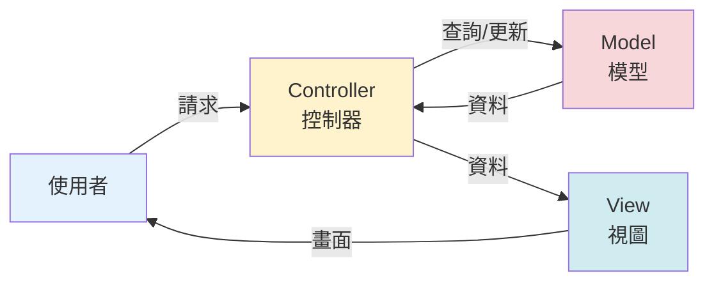
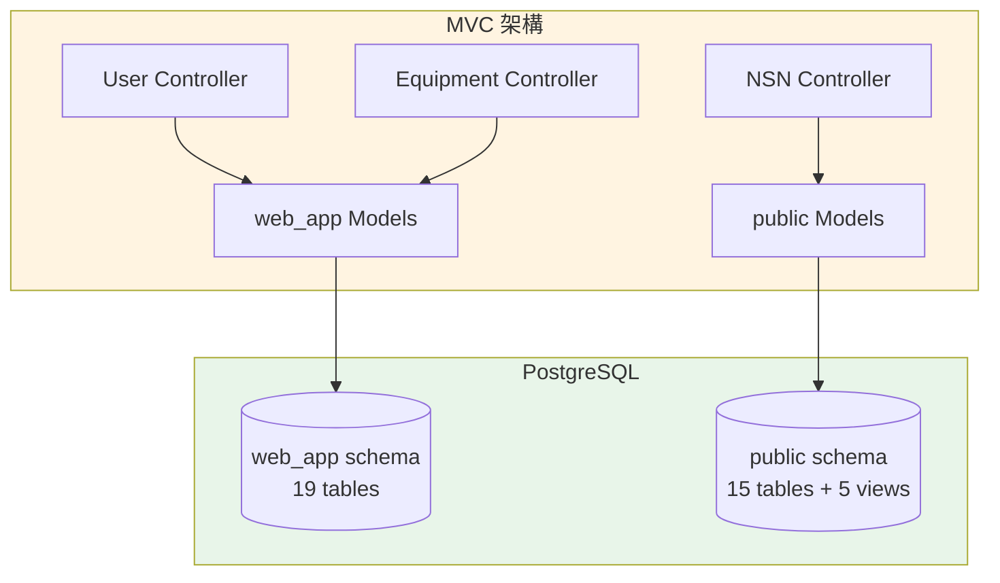
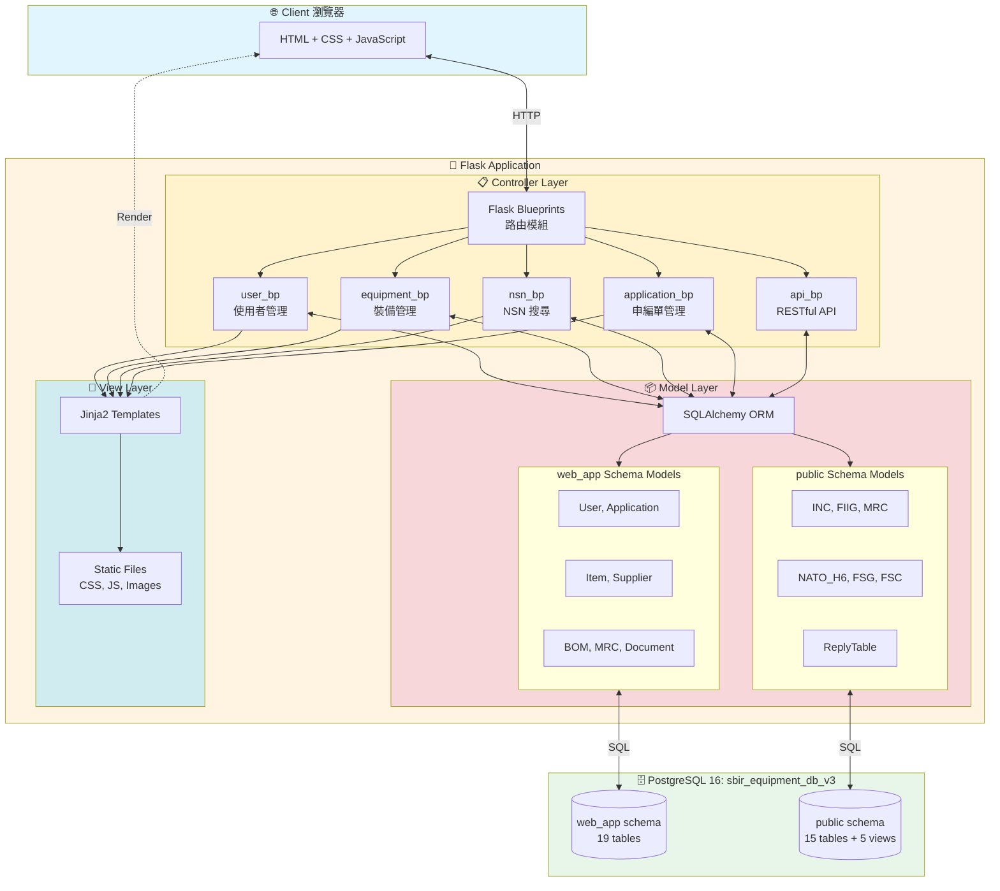
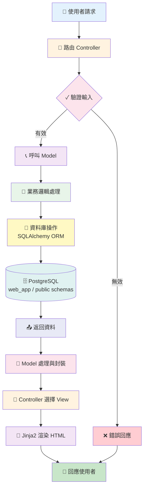
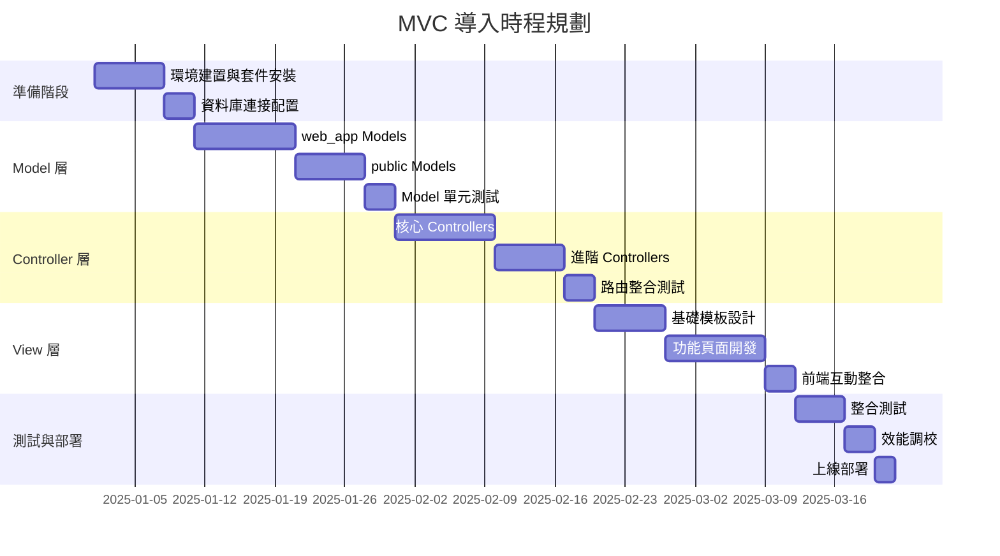

# MVC 架構導入指南 - SBIR 裝備管理系統

**文件編號**: 40-00  
**版本**: 2.0  
**最後更新**: 2025-12-17  
**作者**: SBIR 專案團隊  
**對象**: 工程團隊

---

## 📋 目錄

- [1. 為什麼要導入 MVC](#1-為什麼要導入-mvc)
- [2. MVC 是什麼](#2-mvc-是什麼)
- [3. 系統架構設計](#3-系統架構設計)
- [4. 實施流程](#4-實施流程)
- [5. 技術堆疊選擇](#5-技術堆疊選擇)
- [6. 部署策略](#6-部署策略)

---

## 1. 為什麼要導入 MVC

### 1.1 當前問題

系統面臨資料邏輯、業務處理、介面呈現混雜的狀況，導致維護困難、測試複雜、團隊協作效率低落。

### 1.2 MVC 帶來的價值

**關注點分離**：資料、邏輯、介面各司其職，降低耦合度。  
**平行開發**：前後端團隊可獨立作業，加速開發週期。  
**易於維護**：修改單一層級不影響其他層，降低迴歸風險。  
**可測試性**：各層可獨立進行單元測試與整合測試。  
**可擴展性**：新增功能時遵循既有架構模式，減少技術債。

---

## 2. MVC 是什麼

### 2.1 核心概念

MVC 將系統分為三個獨立但協作的層級，各自負責不同職責，透過明確介面溝通。

### 2.2 三層職責

**Model（模型層）**：負責資料存取與業務邏輯，直接與資料庫溝通，提供乾淨的資料介面給 Controller。

**View（視圖層）**：負責呈現資料給使用者，接收 Controller 傳來的資料進行畫面渲染，不包含業務邏輯。

**Controller（控制器層）**：負責接收使用者請求、協調 Model 與 View，處理輸入驗證與流程控制。

### 2.3 與資料庫架構對應

SBIR 系統的雙 schema 架構（web_app 管理裝備、public 管理 NSN）對應到不同的 Model 群組，Controller 依功能選擇對應 Model。

---

## 3. 系統架構設計

### 3.1 整體架構圖

### 3.2 資料流程

### 3.3 模組分工

**Controller 模組**：每個業務功能獨立為一個 Blueprint（使用者、裝備、NSN、申編單、API），降低路由複雜度。

**Model 模組**：依資料庫 schema 分組（web_app 裝備管理、public NSN 搜尋），每個表對應一個 Model 類別。

**View 模組**：模板繼承結構（base → 功能模板），靜態資源集中管理（CSS/JS/Images）。

---

## 4. 實施流程

### 4.1 開發階段劃分

---

**文件版本**: 2.0  
**最後更新**: 2025-12-17  
**維護單位**: SBIR 專案團隊
