# SBIR 裝備資料庫 ER 圖 - 中英文對照

## 📊 資料庫架構圖

本圖展示 sbir_equipment_db 資料庫的實體關聯圖（Entity-Relationship Diagram），包含 **10 個資料表**（V2.0 重構版）及其關聯關係。

**重構說明**：
- ✅ 以 Equipment（裝備）為中心設計
- ✅ 三大主表：Equipment、Item、Supplier
- ✅ 合併 BOM → Equipment_Item_xref（增加可靠度欄位）
- ✅ 合併 ItemAttribute → Item（簡化結構）
- ✅ 重命名 PartNumber → Part_Number_xref（統一命名）

---

## 🎨 ER 圖（Mermaid 語法）

```mermaid
erDiagram
    %% ========================================
    %% 核心表：Equipment (裝備主檔) ⭐
    %% ========================================
    EQUIPMENT ||--o{ EQUIPMENTSPECIFICATION : "1對多"
    EQUIPMENT ||--o{ EQUIPMENT_ITEM_XREF : "多對多"
    EQUIPMENT ||--o{ TECHNICALDOCUMENT : "1對多"

    %% ========================================
    %% 核心表：Item (品項主檔) ⭐
    %% ========================================
    ITEM ||--o{ ITEMSPECIFICATION : "1對多"
    ITEM ||--o{ PART_NUMBER_XREF : "1對多"
    ITEM ||--o{ EQUIPMENT_ITEM_XREF : "多對多"
    ITEM ||--o{ APPLICATIONFORMDETAIL : "1對多"

    %% ========================================
    %% 核心表：Supplier (廠商主檔) ⭐
    %% ========================================
    SUPPLIER ||--o{ PART_NUMBER_XREF : "1對多"

    %% ========================================
    %% ApplicationForm (申編單檔)
    %% ========================================
    APPLICATIONFORM ||--o{ APPLICATIONFORMDETAIL : "1對多"

    %% ========================================
    %% 資料表定義
    %% ========================================

    EQUIPMENT {
        varchar equipment_id PK "單機識別碼CID"
        varchar equipment_name_zh "裝備中文名稱"
        varchar equipment_name_en "裝備英文名稱"
        varchar equipment_type "裝備形式"
        varchar ship_type "艦型"
        varchar position "裝設地點"
        varchar parent_cid "上層裝備CID"
        varchar eswbs_code "族群結構碼HSC"
        int installation_qty "裝置數"
        int total_installation_qty "全艦裝置數"
        varchar maintenance_level "維修等級"
        timestamp created_at "建立時間"
    }

    EQUIPMENTSPECIFICATION {
        varchar equipment_id PK "單機識別碼(FK)"
        int spec_seq_no PK "特性說明序號"
        text spec_description "單機特性說明"
        timestamp created_at "建立時間"
    }

    EQUIPMENT_ITEM_XREF {
        varchar equipment_id PK "單機識別碼(FK)"
        varchar item_id PK "品項識別號(FK)"
        int installation_qty "零附件裝置數"
        varchar installation_unit "裝置單位"
        int delivery_time "交貨時間天"
        decimal failure_rate_per_million "每百萬小時故障次數"
        int mtbf_hours "平均故障間隔"
        decimal mttr_hours "平均修護時間"
        char is_repairable "是否為可修件"
        timestamp created_at "建立時間"
    }

    ITEM {
        varchar item_id PK "品項識別號"
        varchar item_id_last5 "品項識別碼後五碼"
        varchar nsn UK "NSN"
        varchar item_category "統一組類別"
        varchar item_name_zh "中文品名"
        varchar item_name_en "英文品名"
        varchar weapon_system_code "武器系統代號"
        varchar issue_unit "撥發單位"
        decimal unit_price_usd "美金單價"
        int package_qty "單位包裝量"
        varchar storage_life_code "存儲壽限代號"
        varchar security_code "機密性代號"
        varchar manufacturing_capacity "製造能量"
        timestamp created_at "建立時間"
    }

    ITEMSPECIFICATION {
        serial spec_id PK "規格ID"
        varchar item_id FK "品項識別號"
        int spec_no "規格編號"
        varchar spec_zh "規格資料中文"
        varchar spec_en "規格資料英文"
        varchar answer_zh "中答"
        varchar answer_en "英答"
        timestamp created_at "建立時間"
    }

    SUPPLIER {
        serial supplier_id PK "廠商ID"
        varchar supplier_code UK "廠商來源代號"
        varchar cage_code UK "廠家登記代號CAGE"
        varchar supplier_name_zh "廠商中文名稱"
        varchar supplier_name_en "廠家製造商英文"
        varchar country_code "國家代碼"
        timestamp created_at "建立時間"
    }

    PART_NUMBER_XREF {
        serial part_number_id PK "零件號碼ID"
        varchar part_number "配件號碼PN"
        varchar item_id FK "品項識別號"
        int supplier_id FK "廠商ID"
        varchar obtain_level "獲得程度"
        boolean is_primary "是否為主要零件號"
        timestamp created_at "建立時間"
    }

    TECHNICALDOCUMENT {
        serial document_id PK "文件ID"
        varchar equipment_id FK "單機識別碼"
        varchar document_name "圖名書名"
        varchar document_version "版別版次"
        varchar shipyard_drawing_no "船廠圖號"
        varchar document_type "資料類型"
        varchar language "語言"
        timestamp created_at "建立時間"
    }

    APPLICATIONFORM {
        serial form_id PK "表單ID"
        varchar form_no UK "表單編號"
        varchar submit_status "提送狀態"
        varchar applicant_accounting_code "申請單位會計編號"
        date created_date "建立日期"
    }

    APPLICATIONFORMDETAIL {
        serial detail_id PK "明細ID"
        int form_id FK "表單ID"
        int item_seq "項次"
        varchar item_id FK "品項識別號"
        varchar document_source "文件來源"
        varchar image_path "圖片路徑"
        timestamp created_at "建立時間"
    }
```



---

## 📋 資料表中英文對照總表（V2.0）

| 英文表名 | 中文表名 | 簡稱 | 主要用途 |
|---------|---------|------|---------|
| **Equipment** | **裝備主檔** | 裝備 | ⭐ 核心表：管理艦艇裝備基本資料 |
| **Item** | **品項主檔** | 品項 | ⭐ 核心表：管理零件、材料等品項基本資料（含屬性） |
| **Supplier** | **廠商主檔** | 廠商 | ⭐ 核心表：供應商/製造商基本資料 |
| **Equipment_Item_xref** | **裝備品項關聯檔** | 裝備-品項 | 裝備與品項的多對多關聯（含可靠度資料） |
| **Part_Number_xref** | **零件號碼關聯檔** | 零件號 | 品項-零件號-廠商多對多關聯 |
| **EquipmentSpecification** | **裝備特性說明檔** | 裝備特性 | 裝備的詳細特性說明（1:N） |
| **ItemSpecification** | **品項規格檔** | 品項規格 | 品項的詳細規格說明（1:N） |
| **TechnicalDocument** | **技術文件檔** | 技術文件 | 裝備相關技術文件與圖面 |
| **ApplicationForm** | **申編單檔** | 申編單 | 申編單主檔 |
| **ApplicationFormDetail** | **申編單明細檔** | 申編明細 | 申編單明細資料 |

**已刪除的表（合併到其他表）**：
- ❌ **BOM** → 合併到 Equipment_Item_xref（可靠度資料）
- ❌ **ItemAttribute** → 合併到 Item（品項屬性）

---

## 🔗 關聯關係說明

### 核心關聯：Equipment（裝備主檔）⭐

以 Equipment 為中心的設計架構：

| 關聯表 | 關聯類型 | 關係 | 說明 |
|--------|---------|------|------|
| **EquipmentSpecification** | 1:N | Equipment → EquipmentSpecification | 一個裝備可有多個特性說明 |
| **Equipment_Item_xref** | N:M | Equipment ↔ Item | 裝備包含哪些品項（含數量、可靠度） |
| **TechnicalDocument** | 1:N | Equipment → TechnicalDocument | 裝備的技術文件 |

### 次要核心：Item（品項主檔）⭐

| 關聯表 | 關聯類型 | 關係 | 說明 |
|--------|---------|------|------|
| **ItemSpecification** | 1:N | Item → ItemSpecification | 一個品項可有多個規格說明（最多5組） |
| **Part_Number_xref** | N:M | Item ↔ Supplier | 品項的零件號，來自不同廠商 |
| **Equipment_Item_xref** | N:M | Item ↔ Equipment | 品項被哪些裝備使用 |
| **ApplicationFormDetail** | N:1 | Item ← ApplicationFormDetail | 品項被哪些申編單引用 |

### 第三主表：Supplier（廠商主檔）⭐

| 關聯表 | 關聯類型 | 關係 | 說明 |
|--------|---------|------|------|
| **Part_Number_xref** | 1:N | Supplier → Part_Number_xref | 廠商提供的零件號 |

### 其他關聯

| 關聯表A | 關聯表B | 關聯類型 | 說明 |
|---------|---------|---------|------|
| **ApplicationForm** | **ApplicationFormDetail** | 1:N | 申編單的明細 |

---

## 🎯 資料流向圖（V2.0 重構版）

```
┌─────────────────────────────────────────────────────────────┐
│                         資料輸入來源                         │
│          （Excel M表：19M, 20M, 2M, 3M, 16M, 18M）          │
└─────────────────────────────────────────────────────────────┘
                              ↓
                              ↓
┌─────────────────────────────────────────────────────────────┐
│                    第一階段：三大主表建立                     │
├─────────────────────────────────────────────────────────────┤
│  1️⃣ Supplier (廠商主檔) ⭐       - 來源：19M, 20M           │
│  2️⃣ Equipment (裝備主檔) ⭐      - 來源：2M, 3M             │
│  3️⃣ Item (品項主檔) ⭐           - 來源：19M                │
│     └─ 包含原 ItemAttribute 欄位                            │
└─────────────────────────────────────────────────────────────┘
                              ↓
                              ↓
┌─────────────────────────────────────────────────────────────┐
│                   第二階段：關聯表建立                        │
├─────────────────────────────────────────────────────────────┤
│  4️⃣ Part_Number_xref (零件號關聯) - 來源：20M, 19M          │
│  5️⃣ Equipment_Item_xref (裝備品項) - 來源：18M              │
│     └─ 包含原 BOM 可靠度欄位                                │
└─────────────────────────────────────────────────────────────┘
                              ↓
                              ↓
┌─────────────────────────────────────────────────────────────┐
│                   第三階段：輔助資料建立                      │
├─────────────────────────────────────────────────────────────┤
│  6️⃣ TechnicalDocument (技術文件)      - 來源：待補充        │
│  7️⃣ EquipmentSpecification (裝備特性) - 來源：16M           │
│  8️⃣ ItemSpecification (品項規格)      - 來源：待補充        │
│  9️⃣ ApplicationForm (申編單)          - 來源：待補充        │
│  🔟 ApplicationFormDetail (申編明細)   - 來源：待補充        │
└─────────────────────────────────────────────────────────────┘
                              ↓
                              ↓
┌─────────────────────────────────────────────────────────────┐
│                         應用系統                            │
│         （Web介面、API、報表系統、查詢系統）                 │
└─────────────────────────────────────────────────────────────┘
```

---

## 📊 簡化版關聯圖（文字版）

```
                        ApplicationForm (申編單檔)
                               │
                               │ 1:N
                               ↓
                    ApplicationFormDetail (申編單明細)
                               │
                               │ N:1
                               ↓
    ┌─────────────────────────────────────────────────┐
    │                                                 │
    │          EQUIPMENT (裝備主檔) ⭐                │
    │              核心表                             │
    │                                                 │
    └─────────────────────────────────────────────────┘
              │              │              │
              │ 1:N          │ N:M          │ 1:N
              ↓              ↓              ↓
       EquipmentSpec  Equipment_Item_xref  TechnicalDoc
       (裝備特性)           │              (技術文件)
                            │
                            │ N:M
                            ↓
    ┌─────────────────────────────────────────────────┐
    │                                                 │
    │              ITEM (品項主檔) ⭐                 │
    │              (含ItemAttribute屬性)              │
    │                                                 │
    └─────────────────────────────────────────────────┘
         │           │           │
         │ 1:N       │ 1:N       │ N:M
         ↓           ↓           ↓
    ItemSpec   Part_Number_xref  ApplicationFormDetail
    (規格)           │           (申編明細)
                     │ N:1
                     ↓
    ┌─────────────────────────────────────────────────┐
    │                                                 │
    │            SUPPLIER (廠商主檔) ⭐               │
    │                                                 │
    └─────────────────────────────────────────────────┘
```

---

## 🔑 主鍵與外鍵對照表

### 主鍵類型

| 主鍵類型 | 資料表 | 主鍵欄位 | 中文說明 |
|---------|--------|---------|---------|
| **SERIAL自動編號** | Supplier | supplier_id | 廠商ID |
| | Part_Number_xref | part_number_id | 零件號碼ID |
| | TechnicalDocument | document_id | 文件ID |
| | ItemSpecification | spec_id | 規格ID |
| | ApplicationForm | form_id | 表單ID |
| | ApplicationFormDetail | detail_id | 明細ID |
| **業務邏輯鍵** | Equipment | equipment_id | 單機識別碼(CID) |
| | Item | item_id | 品項識別號(NIIN) |
| **複合主鍵** | Equipment_Item_xref | (equipment_id, item_id) | 裝備-品項 |
| | EquipmentSpecification | (equipment_id, spec_seq_no) | 裝備-序號 |

### 重要外鍵關聯

| 子表 | 外鍵欄位 | 父表 | 刪除規則 | 說明 |
|------|---------|------|---------|------|
| ItemSpecification | item_id | Item | CASCADE | 刪除品項時連帶刪除規格 |
| Part_Number_xref | item_id | Item | CASCADE | 刪除品項時連帶刪除零件號 |
| Part_Number_xref | supplier_id | Supplier | SET NULL | 刪除廠商時零件號的廠商ID設為NULL |
| Equipment_Item_xref | equipment_id | Equipment | CASCADE | 刪除裝備時連帶刪除關聯 |
| Equipment_Item_xref | item_id | Item | CASCADE | 刪除品項時連帶刪除關聯 |
| EquipmentSpecification | equipment_id | Equipment | CASCADE | 刪除裝備時連帶刪除特性 |
| TechnicalDocument | equipment_id | Equipment | CASCADE | 刪除裝備時連帶刪除文件 |
| ApplicationFormDetail | form_id | ApplicationForm | CASCADE | 刪除申編單時連帶刪除明細 |
| ApplicationFormDetail | item_id | Item | SET NULL | 刪除品項時明細的品項ID設為NULL |

---

## 📝 資料匯入順序建議

根據外鍵依賴關係，建議按以下順序匯入資料：

1. **第一批（無依賴）- 三大主表**
   - ✅ Supplier (廠商主檔)
   - ✅ Equipment (裝備主檔)
   - ✅ Item (品項主檔)
   - ✅ ApplicationForm (申編單檔)

2. **第二批（依賴第一批）**
   - ✅ ItemSpecification (品項規格檔) - 依賴 Item
   - ✅ Part_Number_xref (零件號碼關聯檔) - 依賴 Item, Supplier
   - ✅ EquipmentSpecification (裝備特性檔) - 依賴 Equipment
   - ✅ TechnicalDocument (技術文件檔) - 依賴 Equipment

3. **第三批（依賴第一、二批）**
   - ✅ Equipment_Item_xref (裝備品項關聯檔) - 依賴 Equipment, Item
   - ✅ ApplicationFormDetail (申編單明細檔) - 依賴 ApplicationForm, Item

---

## 🎨 圖例說明

### Mermaid 圖例
- `||--o{` : 一對多關係（One-to-Many）
- `}o--o{` : 多對多關係（Many-to-Many）
- `||--||` : 一對一關係（One-to-One）
- `PK` : Primary Key（主鍵）
- `FK` : Foreign Key（外鍵）
- `UK` : Unique Key（唯一鍵）

### 資料表標記
- ⭐ : 核心表
- 🔑 : 主鍵欄位
- 🔗 : 外鍵欄位
- 📝 : 選填欄位
- ✅ : 必填欄位

---

## 📦 V2.0 重構總結

### 重構前（V1.0）：12 個表
- Supplier, Equipment, Item, ItemAttribute, PartNumber
- Equipment_Item_xref, BOM
- TechnicalDocument, EquipmentSpecification, ItemSpecification
- ApplicationForm, ApplicationFormDetail

### 重構後（V2.0）：10 個表
- **三大主表**：Supplier, Equipment, Item
- **兩個關聯表**：Part_Number_xref, Equipment_Item_xref
- **五個輔助表**：EquipmentSpecification, ItemSpecification, TechnicalDocument, ApplicationForm, ApplicationFormDetail

### 重構變更
1. ✅ **BOM → Equipment_Item_xref**
   - 將 BOM 的可靠度欄位（delivery_time, mtbf_hours, mttr_hours, failure_rate_per_million, is_repairable）合併到 Equipment_Item_xref
   - 不再使用 Item-Item 自關聯，改為 Equipment-Item 關聯

2. ✅ **ItemAttribute → Item**
   - 將 ItemAttribute 的所有欄位（14個屬性欄位）合併到 Item 主表
   - 簡化 1:1 關係，減少 JOIN 操作

3. ✅ **PartNumber → Part_Number_xref**
   - 表名統一使用 xref 命名規範
   - 結構不變

---

**文件版本**: 2.0
**建立日期**: 2025-11-11
**資料庫**: sbir_equipment_db V2.0 (重構版)
**維護單位**: SBIR 專案團隊
