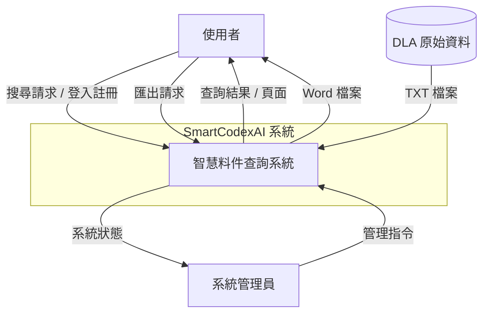
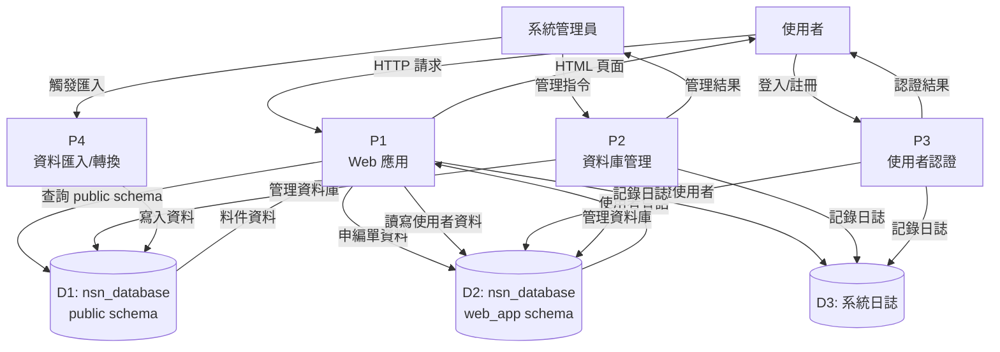
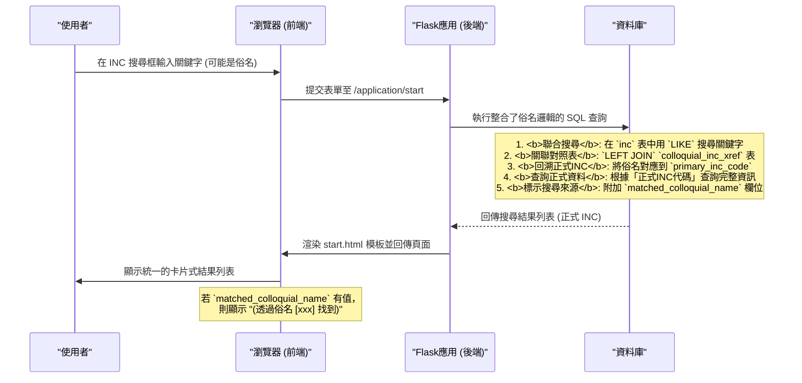

# 附件五：系統資料流設計

## 1. 系統資料流概述

SmartCodexAI 系統的資料流設計旨在高效處理料件查詢請求，整合多個資料來源，並提供快速回應。系統採用分層架構，並基於「單一資料庫、雙 Schema」的原則，確保資料的一致性和安全性。

## 2. 系統層級資料流圖 (Level 0 DFD)



## 3. 第一層資料流圖 (Level 1 DFD)



## 4. 資料字典 (Data Dictionary)

| 資料儲存 | 描述 | 主要內容 |
|---|---|---|
| D1: `public` schema | 核心料件資料庫 | `fsc`, `inc`, `nato_h6_item_name` 等15張核心資料表 |
| D2: `web_app` schema | 網頁應用程式資料庫 | `users`, `user_sessions`, `applications` 等使用者與申編單相關資料表 |
| D3: 系統日誌 | 操作與錯誤記錄 | 時間戳、操作類型、使用者、結果等 |

| 資料流 | 描述 | 主要內容 |
|---|---|---|
| 申编单资料 | 使用者提交的料號申編表單內容 | `id` (系統唯一主鍵), `form_serial_number` (使用者自訂流水號), `official_nsn` (預留欄位), 以及其他表單欄位 |

## 5. 資料處理流程

本節展示系統核心的搜尋資料處理流程，特別是如何整合「俗名」查詢邏輯。



## 6. 資料安全與備份

### 6.1 資料庫備份 (Docker)

推薦使用 `pg_dump` 在 Docker 環境中進行備份。

**手動備份指令範例:**
```bash
# 對整個 nsn_database 進行備份
docker-compose exec postgres pg_dump -U postgres -d nsn_database > backup.sql

# 只備份 public schema
docker-compose exec postgres pg_dump -U postgres -d nsn_database -n public > backup_public.sql

# 只備份 web_app schema
docker-compose exec postgres pg_dump -U postgres -d nsn_database -n web_app > backup_webapp.sql
```

### 6.2 資料庫恢復 (Docker)

```bash
# 恢復整個資料庫
cat backup.sql | docker-compose exec -T postgres psql -U postgres -d nsn_database
```

## 7. 資料一致性保證

- **應用層**: 使用 `Flask-SQLAlchemy` 管理資料庫會話，確保交易的原子性。
- **資料庫層**:
  - **`public` schema**: 透過 SQL 腳本建立的嚴格外鍵約束來保證資料的參照完整性。
  - **`web_app` schema**: 使用 `Flask-Migrate` 進行結構遷移，確保資料在變更過程中的一致性。

---
**文檔版本**: v4.0 (Docker-based)  
**更新日期**: 2025年8月7日
