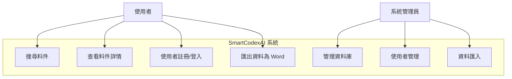
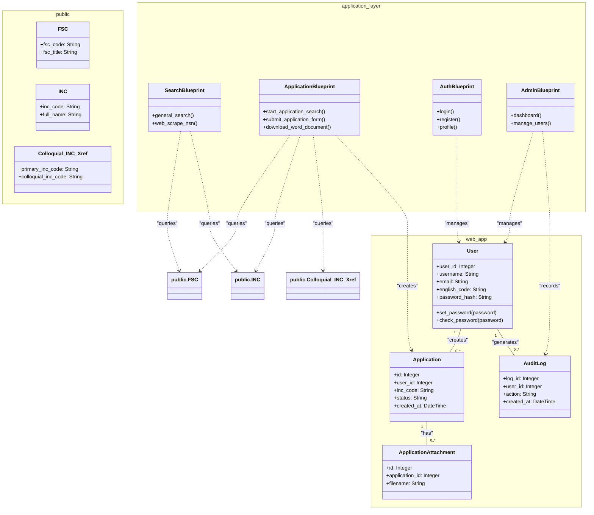
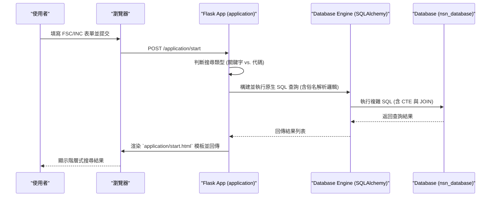
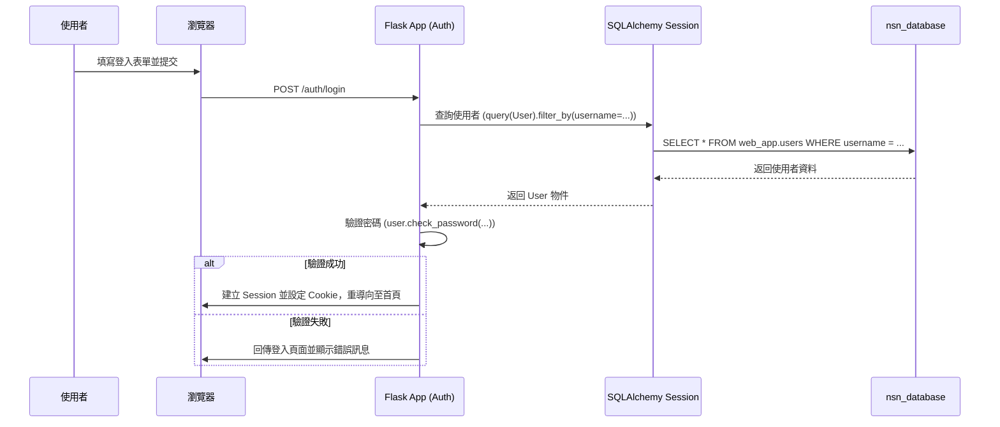
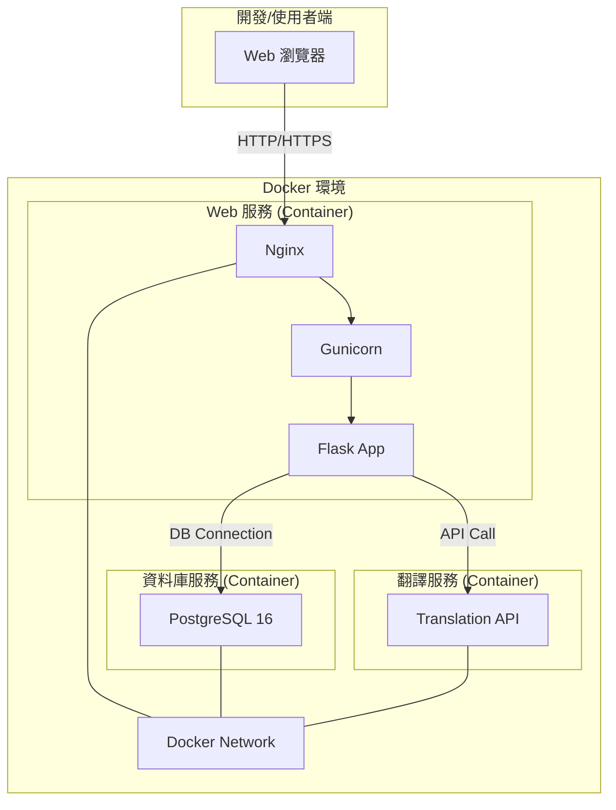

# 附件六：UML 設計

## 1. 用例圖 (Use Case Diagram)

## 2. 類圖 (Class Diagram)

此類圖展示了基於「雙 Schema」架構的核心模型，並區分了不同的應用功能模組。

## 3. 時序圖 (Sequence Diagram)

### 料件搜尋與申編流程

### 使用者登入流程

## 4. 部署圖 (Deployment Diagram)

此部署圖反映了基於 `docker-compose.yml` 的實際部署架構。

---
**文檔版本**: v4.1 (Synced with admin features)
**更新日期**: 2025年10月14日
