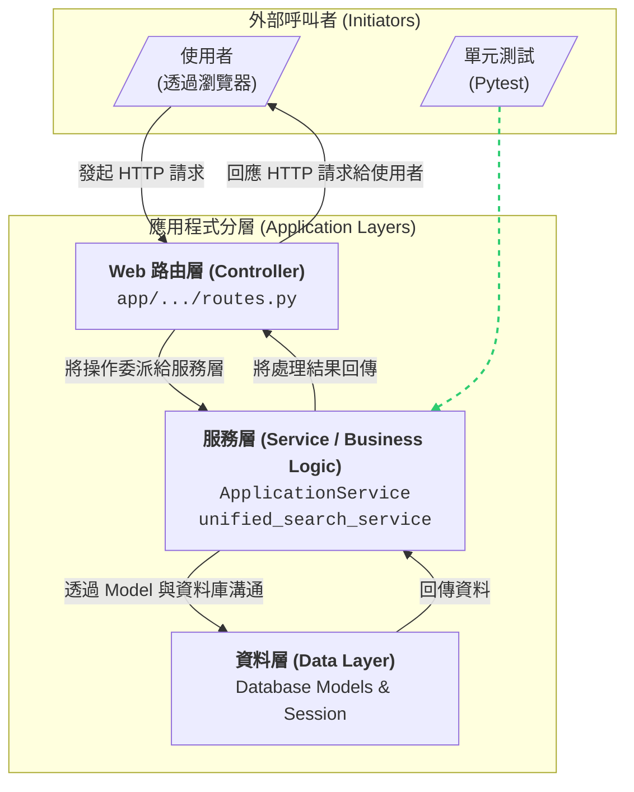

# 模組化服務層架構圖

本文件旨在說明 SmartCodexAI 專案中，核心商業邏輯如何被分離到獨立的**服務層 (Service Layer)**，以實現關注點分離 (Separation of Concerns)、提高程式碼的可測試性與可維護性。

主要的服務模組有兩個：
1.  `app.search.unified_search_service`: 專門處理複雜的 FSC/INC 搜尋邏輯。
2.  `app.application.services.ApplicationService`: 專門處理料號申編單 (Application) 的所有 CRUD (建立、讀取、更新、刪除) 操作。

---

## 簡化架構流程圖

此圖表聚焦於展示不同模組之間的**呼叫關係**與**分層**概念。

### 流程解說

1.  **標準 Web 請求流程 (實線箭頭)**:
    *   使用者的操作會觸發一個標準的 Web 請求，由**路由層 (Controller)** 接收。
    *   路由層**不自己處理**複雜的邏輯，而是作為一個**指揮官**，將任務**委派**給**服務層 (Service)**。
    *   服務層是**真正執行工作**的地方，它會與**資料層 (Data Layer)** 進行溝通來存取資料庫。
    *   最後，結果會逐層回傳，直到路由層將最終的頁面或資料回應給使用者。

2.  **單元測試流程 (虛線箭頭)**:
    *   這是模組化最重要的優勢。我們的測試程式可以**繞過**整個 Web 層，**直接呼叫服務層**中的函式。
    *   這使得我們可以針對最核心的商業邏輯進行快速、穩定且獨立的測試，確保其正確性。

這個簡化後的版本，希望能讓您更清晰地看到我們所建立的三層式架構，以及外部呼叫如何與之互動。
