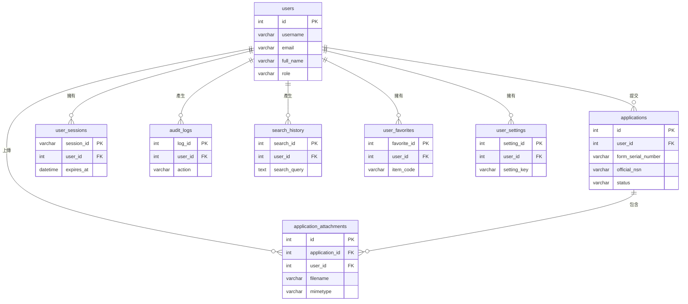

# 附件四：`web_app` Schema 資料表欄位詳細說明

---

## 📋 文檔說明

本文檔詳細描述當前 `web_app` schema 中所有資料表的欄位定義、資料類型與約束條件。此 schema 負責處理所有與前端網頁應用程式相關的功能，包含使用者管理、申編單儲存、會話控制等。

- **核心功能**: 使用者認證、申編單生命週期管理、附件儲存、使用者活動記錄。
- **對應模型**: 此 schema 中的所有表格都與 `app/models.py` 中的 SQLAlchemy 模型一一對應。
- **更新狀態**: 與 `sql/web_app_schema.sql` 及最新的資料庫遷移 (`migrations`) 狀態保持同步。

---

## 🔹 `web_app` Schema 實體關聯圖 (ERD)

下圖展示了 `web_app` schema 中核心資料表的關聯性，以 `users` 和 `applications` 為中心。

---

## 🔹 使用者核心 (3張表格)

### 1. `web_app.users` - 使用者主檔
**功能**: 儲存系統所有使用者的基本資料、認證資訊與角色。
| 欄位名稱 | 資料類型 | 約束 | 說明 |
|---|---|---|---|
| `id` | SERIAL | PK | 使用者唯一ID (主鍵) |
| `username` | VARCHAR(80) | NOT NULL, UNIQUE | 使用者名稱 |
| `email` | VARCHAR(120) | NOT NULL, UNIQUE | 電子信箱 |
| `password_hash` | VARCHAR(256) | NOT NULL | 加密後的密碼雜湊 |
| `english_code` | VARCHAR(10) | UNIQUE | 英文代號 (用於自動產生表單編號) |
| `full_name` | VARCHAR(100) | - | 姓名 |
| `department` | VARCHAR(100) | - | 部門 |
| `position` | VARCHAR(100) | - | 職位 |
| `phone` | VARCHAR(50) | - | 聯絡電話 |
| `role` | VARCHAR(20) | NOT NULL | 角色 (e.g., 'user', 'admin') |
| `is_active` | BOOLEAN | NOT NULL, DEFAULT TRUE | 帳號是否啟用 |
| `is_verified` | BOOLEAN | DEFAULT FALSE | 信箱是否已驗證 |
| `created_at` | TIMESTAMP | DEFAULT NOW() | 建立時間 |
| `updated_at` | TIMESTAMP | DEFAULT NOW() | 更新時間 |

### 2. `web_app.user_sessions` - 使用者會話
**功能**: 管理使用者登入後的會話狀態，實現「記住我」等功能。
| 欄位名稱 | 資料類型 | 約束 | 說明 |
|---|---|---|---|
| `session_id` | VARCHAR(255) | PK | 會話唯一ID (主鍵) |
| `user_id` | INTEGER | NOT NULL, FK | 對應的 `users.id` |
| `ip_address` | VARCHAR(45) | - | 使用者IP位址 |
| `user_agent` | TEXT | - | 瀏覽器資訊 |
| `is_active` | BOOLEAN | DEFAULT TRUE | 會話是否有效 |
| `expires_at` | TIMESTAMP | NOT NULL | 會話過期時間 |
| `created_at` | TIMESTAMP | - | 建立時間 |

### 3. `web_app.user_settings` - 使用者個人設定
**功能**: 儲存每個使用者的個人化設定。
| 欄位名稱 | 資料類型 | 約束 | 說明 |
|---|---|---|---|
| `setting_id` | SERIAL | PK | 設定ID (主鍵) |
| `user_id` | INTEGER | NOT NULL, FK | 對應的 `users.id` |
| `setting_key` | VARCHAR(100) | NOT NULL | 設定鍵 (e.g., 'theme') |
| `setting_value` | TEXT | - | 設定值 |

---

## 🔹 申編單核心 (2張表格)

### 4. `web_app.applications` - 料號申編單主檔
**功能**: 儲存使用者提交的每一份料號申編單的完整內容。
| 欄位名稱 | 資料類型 | 約束 | 說明 |
|---|---|---|---|
| `id` | SERIAL | PK | **系統唯一ID (主鍵)** |
| `user_id` | INTEGER | NOT NULL, FK | 提交使用者的ID |
| `form_serial_number` | VARCHAR(50) | - | **使用者可自訂的表單流水號**，允許重複 |
| `part_number` | VARCHAR(50) | - | 系統產生的初始料號 (e.g., 4碼FSC + YETL) |
| `english_name` | VARCHAR(255) | - | 英文品名 |
| `chinese_name` | VARCHAR(255) | - | 中文品名 |
| `inc_code` | VARCHAR(20) | - | 品名代號 (INC) |
| `fiig_code` | VARCHAR(20) | - | 物品識別指南 (FIIG) |
| `official_nsn` | VARCHAR(50) | - | **預留欄位**，用於回填申請通過後的**正式料號** |
| `status` | VARCHAR(50) | DEFAULT 'pending' | 申編單狀態 (e.g., 'pending', 'approved') |
| `created_at` | TIMESTAMP | DEFAULT NOW() | 建立時間 |
| `updated_at` | TIMESTAMP | DEFAULT NOW() | 更新時間 |

### 5. `web_app.application_attachments` - 申編單附件
**功能**: 儲存使用者上傳至申編單的附件檔案 (圖片、PDF等)。
| 欄位名稱 | 資料類型 | 約束 | 說明 |
|---|---|---|---|
| `id` | SERIAL | PK | 附件唯一ID (主鍵) |
| `application_id` | INTEGER | NOT NULL, FK | 關聯的 `applications.id`，確保與主表單的穩定連結 |
| `user_id` | INTEGER | NOT NULL, FK | 上傳使用者的ID |
| `file_data` | BYTEA | NOT NULL | 檔案的二進位內容 |
| `filename` | VARCHAR(255) | NOT NULL | 儲存在系統中的安全檔名 |
| `original_filename` | VARCHAR(255) | - | 使用者上傳時的原始檔名 |
| `mimetype` | VARCHAR(100) | NOT NULL | 檔案的MIME類型 (e.g., 'image/jpeg') |
| `created_at` | TIMESTAMP | DEFAULT NOW() | 上傳時間 |

---

## 🔹 使用者活動與收藏 (3張表格)

### 6. `web_app.search_history` - 搜尋紀錄
**功能**: 記錄使用者的搜尋歷史，方便追溯與分析。
| 欄位名稱 | 資料類型 | 約束 | 說明 |
|---|---|---|---|
| `search_id` | SERIAL | PK | 紀錄ID (主鍵) |
| `user_id` | INTEGER | FK | 使用者ID |
| `search_query`| TEXT | NOT NULL | 搜尋的關鍵字 |
| `search_type` | VARCHAR(50) | - | 搜尋類型 |
| `results_count`| INTEGER | - | 結果數量 |
| `created_at` | TIMESTAMP | DEFAULT NOW() | 搜尋時間 |

### 7. `web_app.user_favorites` - 使用者收藏
**功能**: 讓使用者可以收藏感興趣的料號項目。
| 欄位名稱 | 資料類型 | 約束 | 說明 |
|---|---|---|---|
| `favorite_id` | SERIAL | PK | 收藏ID (主鍵) |
| `user_id` | INTEGER | NOT NULL, FK | 使用者ID |
| `item_type` | VARCHAR(50) | NOT NULL | 收藏的項目類型 (e.g., 'inc', 'fsc') |
| `item_code` | VARCHAR(100)| NOT NULL | 收藏的項目代碼 |
| `item_name` | TEXT | - | 項目名稱 |
| `notes` | TEXT | - | 使用者筆記 |

### 8. `web_app.audit_logs` - 操作日誌
**功能**: 記錄系統中的重要操作，供未來審計追蹤使用。
| 欄位名稱 | 資料類型 | 約束 | 說明 |
|---|---|---|---|
| `log_id` | SERIAL | PK | 日誌ID (主鍵) |
| `user_id` | INTEGER | FK | 操作者的使用者ID |
| `action` | VARCHAR(100)| NOT NULL | 執行的操作 (e.g., 'LOGIN', 'CREATE_APPLICATION') |
| `resource_type`| VARCHAR(50) | - | 操作的資源類型 |
| `resource_id` | VARCHAR(100)| - | 操作的資源ID |
| `success` | BOOLEAN | - | 操作是否成功 |
| `ip_address` | VARCHAR(45) | - | 操作時的IP位址 |
| `created_at` | TIMESTAMP | DEFAULT NOW() | 操作時間 |

---

## 🔹 系統管理 (2張表格)

### 9. `web_app.system_settings` - 系統設定
**功能**: 儲存全域的系統級設定。
| 欄位名稱 | 資料類型 | 約束 | 說明 |
|---|---|---|---|
| `setting_id` | SERIAL | PK | 設定ID (主鍵) |
| `setting_key` | VARCHAR(100)| NOT NULL, UNIQUE | 設定鍵 |
| `setting_value`| TEXT | - | 設定值 |
| `description` | TEXT | - | 設定說明 |

### 10. `web_app.system_statistics` - 系統統計
**功能**: 用於儲存每日的系統使用統計資料，供效能分析與監控。
| 欄位名稱 | 資料類型 | 約束 | 說明 |
|---|---|---|---|
| `stat_id` | SERIAL | PK | 統計ID (主鍵) |
| `stat_date` | DATE | NOT NULL, UNIQUE | 統計日期 |
| `total_users` | INTEGER | - | 總使用者數 |
| `active_users`| INTEGER | - | 當日活躍使用者數 |
| `total_searches`| INTEGER | - | 當日總搜尋次數 |

---
**文檔版本**: v1.1 (Synced ERD with tables)
**更新日期**: 2025年10月14日
