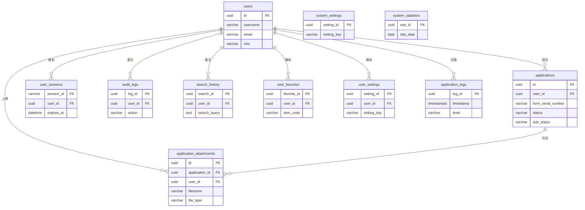

# 附件四：`web_app` Schema 資料表欄位詳細說明

---

## 📋 文檔說明

本文檔詳細描述當前 `web_app` schema 中所有資料表的欄位定義、資料類型與約束條件。此 schema 負責處理所有與前端網頁應用程式相關的功能，包含使用者管理、申編單儲存、會話控制等。

- **核心功能**: 使用者認證、申編單生命週期管理、附件儲存、使用者活動記錄。
- **對應模型**: 此 schema 中的所有表格都與 `app/models.py` 中的 SQLAlchemy 模型一一對應。
- **更新狀態**: 以 `sql/web_app_schema.sql` 的欄位與型別為準。

---

## 🔹 `web_app` Schema 實體關聯圖 (ERD)

下圖展示了 `web_app` schema 中核心資料表的關聯性，以 `users` 和 `applications` 為中心。

---

## 🔹 使用者核心 (3張表格)

### 1. `web_app.users` - 使用者主檔
**功能**: 儲存系統所有使用者的基本資料、認證資訊與角色。
| 欄位名稱 | 資料類型 | 約束 | 說明 |
|---|---|---|---|
| `id` | UUID | PK, NOT NULL, DEFAULT uuid_generate_v7() | 使用者唯一ID (主鍵) |
| `username` | VARCHAR(80) | NOT NULL, UNIQUE | 使用者名稱 |
| `email` | VARCHAR(120) | NOT NULL, UNIQUE | 電子信箱 |
| `password_hash` | VARCHAR(256) | NOT NULL | 加密後的密碼雜湊 |
| `english_code` | VARCHAR(10) | UNIQUE | 英文代號 (用於自動產生表單編號) |
| `full_name` | VARCHAR(100) | - | 姓名 |
| `department` | VARCHAR(100) | - | 部門 |
| `position` | VARCHAR(100) | - | 職位 |
| `phone` | VARCHAR(50) | - | 聯絡電話 |
| `role` | VARCHAR(20) | NOT NULL | 角色 (e.g., 'user', 'admin') |
| `is_active` | BOOLEAN | NOT NULL | 帳號是否啟用 |
| `is_verified` | BOOLEAN | - | 信箱是否已驗證 |
| `email_verified_at` | TIMESTAMP | - | 信箱驗證時間 |
| `last_login_at` | TIMESTAMP | - | 最後登入時間 |
| `failed_login_attempts` | INTEGER | - | 登入失敗次數 |
| `locked_until` | TIMESTAMP | - | 帳號鎖定到期時間 |
| `created_at` | TIMESTAMP | DEFAULT NOW() | 建立時間 |
| `updated_at` | TIMESTAMP | DEFAULT NOW() | 更新時間 |

### 2. `web_app.user_sessions` - 使用者會話
**功能**: 管理使用者登入後的會話狀態，實現「記住我」等功能。
| 欄位名稱 | 資料類型 | 約束 | 說明 |
|---|---|---|---|
| `session_id` | VARCHAR(255) | PK, NOT NULL | 會話唯一ID (主鍵) |
| `user_id` | UUID | NOT NULL, FK | 對應的 `users.id` |
| `ip_address` | VARCHAR(45) | - | 使用者IP位址 |
| `user_agent` | TEXT | - | 瀏覽器資訊 |
| `is_active` | BOOLEAN | - | 會話是否有效 |
| `remember_me` | BOOLEAN | - | 是否啟用記住我 |
| `expires_at` | TIMESTAMP | NOT NULL | 會話過期時間 |
| `created_at` | TIMESTAMP | - | 建立時間 |
| `last_activity_at` | TIMESTAMP | - | 最後活動時間 |

### 3. `web_app.user_settings` - 使用者個人設定
**功能**: 儲存每個使用者的個人化設定。
| 欄位名稱 | 資料類型 | 約束 | 說明 |
|---|---|---|---|
| `setting_id` | UUID | PK, NOT NULL, DEFAULT uuid_generate_v7() | 設定ID (主鍵) |
| `user_id` | UUID | NOT NULL, FK | 對應的 `users.id` |
| `setting_key` | VARCHAR(100) | NOT NULL | 設定鍵 (e.g., 'theme') |
| `setting_value` | TEXT | - | 設定值 |
| `created_at` | TIMESTAMP | - | 建立時間 |
| `updated_at` | TIMESTAMP | - | 更新時間 |

---

## 🔹 申編單核心 (2張表格)

### 4. `web_app.applications` - 料號申編單主檔
**功能**: 儲存使用者提交的每一份料號申編單的完整內容。
| 欄位名稱 | 資料類型 | 約束 | 說明 |
|---|---|---|---|
| `id` | UUID | PK, NOT NULL, DEFAULT uuid_generate_v7() | 申編單ID (主鍵) |
| `user_id` | UUID | NOT NULL, FK | 提交使用者的ID |
| `form_serial_number` | VARCHAR(50) | - | 使用者可自訂的表單流水號，允許重複 |
| `part_number` | VARCHAR(50) | - | 系統產生的初始料號 (e.g., 4碼FSC + YETL) |
| `english_name` | VARCHAR(255) | - | 英文品名 |
| `chinese_name` | VARCHAR(255) | - | 中文品名 |
| `inc_code` | VARCHAR(20) | - | 品名代號 (INC) |
| `fiig_code` | VARCHAR(20) | - | 物品識別指南 (FIIG) |
| `status` | VARCHAR(50) | - | 申編單狀態 (e.g., 'pending', 'approved') |
| `sub_status` | VARCHAR(50) | - | 流程細分狀態 |
| `created_at` | TIMESTAMP | - | 建立時間 |
| `updated_at` | TIMESTAMP | - | 更新時間 |
| `deleted_at` | TIMESTAMP | - | 軟刪除時間 |
| `accounting_unit_code` | VARCHAR(50) | - | 主計單位代碼 |
| `issue_unit` | VARCHAR(10) | - | 發放單位代碼 |
| `unit_price` | NUMERIC(10, 2) | - | 單價 |
| `spec_indicator` | VARCHAR(10) | - | 規格指示碼 |
| `unit_pack_quantity` | VARCHAR(10) | - | 單位包裝數量 |
| `storage_life_months` | VARCHAR(10) | - | 保存期限 (月) |
| `storage_life_action_code` | VARCHAR(10) | - | 保存期限動作碼 |
| `storage_type_code` | VARCHAR(10) | - | 儲存方式代碼 |
| `secrecy_code` | VARCHAR(10) | - | 保密等級代碼 |
| `expendability_code` | VARCHAR(10) | - | 耗用性代碼 |
| `repairability_code` | VARCHAR(10) | - | 可修復性代碼 |
| `manufacturability_code` | VARCHAR(10) | - | 製造性代碼 |
| `source_code` | VARCHAR(10) | - | 來源代碼 |
| `category_code` | VARCHAR(10) | - | 類別代碼 |
| `system_code` | VARCHAR(100) | - | 系統代碼 |
| `pn_acquisition_level` | VARCHAR(100) | - | 料號取得層級 |
| `pn_acquisition_source` | VARCHAR(100) | - | 料號取得來源 |
| `manufacturer` | VARCHAR(255) | - | 製造商/廠家 |
| `part_number_reference` | VARCHAR(255) | - | 參考號碼 (P/N) |
| `ship_type` | VARCHAR(100) | - | 艦種/船型 |
| `cid_no` | VARCHAR(100) | - | CID 編號 |
| `model_type` | VARCHAR(100) | - | 型式/型號 |
| `equipment_name` | VARCHAR(255) | - | 裝備名稱 |
| `usage_location` | VARCHAR(255) | - | 使用位置 |
| `quantity_per_unit` | INTEGER | - | 單位用量 |
| `mrc_data` | JSON | - | MRC 回答資料 |
| `document_reference` | VARCHAR(255) | - | 參考文件 |
| `manufacturer_name` | VARCHAR(255) | - | 製造商名稱 |
| `agent_name` | VARCHAR(255) | - | 代理商名稱 |
| `applicant_unit` | VARCHAR(100) | - | 申請單位 |
| `contact_info` | VARCHAR(100) | - | 聯絡資訊 |
| `apply_date` | DATE | - | 申請日期 |
| `official_nsn_stamp` | VARCHAR(10) | - | 正式料號蓋章碼 |
| `official_nsn_final` | VARCHAR(20) | - | 完整正式料號 |
| `nsn_filled_at` | TIMESTAMP | - | 正式料號填寫時間 |
| `nsn_filled_by` | UUID | FK | 正式料號填寫者 |
| `closed_at` | TIMESTAMP | - | 結單時間 |
| `closed_by` | UUID | FK | 結單者 |

### 5. `web_app.application_attachments` - 申編單附件
**功能**: 儲存使用者上傳至申編單的附件檔案 (圖片、PDF等)。
| 欄位名稱 | 資料類型 | 約束 | 說明 |
|---|---|---|---|
| `id` | UUID | PK, NOT NULL, DEFAULT uuid_generate_v7() | 附件唯一ID (主鍵) |
| `application_id` | UUID | NOT NULL, FK | 關聯的 `applications.id` |
| `user_id` | UUID | NOT NULL, FK | 上傳使用者的ID |
| `file_data` | BYTEA | NOT NULL | 檔案的二進位內容 |
| `filename` | VARCHAR(255) | NOT NULL | 儲存在系統中的安全檔名 |
| `original_filename` | VARCHAR(255) | - | 使用者上傳時的原始檔名 |
| `mimetype` | VARCHAR(100) | NOT NULL | 檔案的MIME類型 (e.g., 'image/jpeg') |
| `file_type` | VARCHAR(20) | NOT NULL, DEFAULT 'other' | 檔案類型 (image/pdf/other) |
| `page_selection` | VARCHAR(200) | - | PDF 頁碼選擇 (例如: "1-3,5,7-9") |
| `sort_order` | INTEGER | DEFAULT 0 | PDF 合併順序 |
| `created_at` | TIMESTAMP | - | 上傳時間 |
| `updated_at` | TIMESTAMP | DEFAULT CURRENT_TIMESTAMP | 更新時間 |

---

## 🔹 使用者活動與稽核 (3張表格)

### 6. `web_app.search_history` - 搜尋紀錄
**功能**: 記錄使用者的搜尋歷史，方便追溯與分析。
| 欄位名稱 | 資料類型 | 約束 | 說明 |
|---|---|---|---|
| `search_id` | UUID | PK, NOT NULL, DEFAULT uuid_generate_v7() | 搜尋紀錄ID (主鍵) |
| `user_id` | UUID | FK | 使用者ID |
| `session_id` | VARCHAR(255) | - | 會話ID |
| `search_query` | TEXT | NOT NULL | 搜尋的關鍵字 |
| `search_type` | VARCHAR(50) | - | 搜尋類型 |
| `search_filters` | JSON | - | 搜尋條件 |
| `results_count` | INTEGER | - | 結果數量 |
| `execution_time_ms` | INTEGER | - | 執行時間 (毫秒) |
| `ip_address` | VARCHAR(45) | - | 搜尋時的IP位址 |
| `user_agent` | TEXT | - | 瀏覽器資訊 |
| `created_at` | TIMESTAMP | - | 搜尋時間 |

### 7. `web_app.user_favorites` - 使用者收藏
**功能**: 讓使用者可以收藏感興趣的料號項目。
| 欄位名稱 | 資料類型 | 約束 | 說明 |
|---|---|---|---|
| `favorite_id` | UUID | PK, NOT NULL, DEFAULT uuid_generate_v7() | 收藏ID (主鍵) |
| `user_id` | UUID | NOT NULL, FK | 使用者ID |
| `item_type` | VARCHAR(50) | NOT NULL | 收藏的項目類型 (e.g., 'inc', 'fsc') |
| `item_code` | VARCHAR(100) | NOT NULL | 收藏的項目代碼 |
| `item_name` | TEXT | - | 項目名稱 |
| `item_description` | TEXT | - | 項目描述 |
| `notes` | TEXT | - | 使用者筆記 |
| `created_at` | TIMESTAMP | - | 建立時間 |

### 8. `web_app.audit_logs` - 操作日誌
**功能**: 記錄系統中的重要操作，供未來審計追蹤使用。
| 欄位名稱 | 資料類型 | 約束 | 說明 |
|---|---|---|---|
| `log_id` | UUID | PK, NOT NULL, DEFAULT uuid_generate_v7() | 日誌ID (主鍵) |
| `user_id` | UUID | FK | 操作者的使用者ID |
| `action` | VARCHAR(100) | NOT NULL | 執行的操作 (e.g., 'LOGIN', 'CREATE_APPLICATION') |
| `resource_type` | VARCHAR(50) | - | 操作的資源類型 |
| `resource_id` | VARCHAR(100) | - | 操作的資源ID |
| `old_values` | JSON | - | 操作前資料快照 |
| `new_values` | JSON | - | 操作後資料快照 |
| `ip_address` | VARCHAR(45) | - | 操作時的IP位址 |
| `user_agent` | TEXT | - | 瀏覽器資訊 |
| `success` | BOOLEAN | - | 操作是否成功 |
| `error_message` | TEXT | - | 失敗錯誤訊息 |
| `created_at` | TIMESTAMP | - | 操作時間 |

---

## 🔹 系統管理 (2張表格)

### 9. `web_app.system_settings` - 系統設定
**功能**: 儲存全域的系統級設定。
| 欄位名稱 | 資料類型 | 約束 | 說明 |
|---|---|---|---|
| `setting_id` | UUID | PK, NOT NULL, DEFAULT uuid_generate_v7() | 設定ID (主鍵) |
| `setting_key` | VARCHAR(100) | NOT NULL, UNIQUE | 設定鍵 |
| `setting_value` | TEXT | - | 設定值 |
| `setting_type` | VARCHAR(50) | - | 設定類型 |
| `description` | TEXT | - | 設定說明 |
| `is_public` | BOOLEAN | - | 是否公開給前端顯示 |
| `created_at` | TIMESTAMP | - | 建立時間 |
| `updated_at` | TIMESTAMP | - | 更新時間 |

### 10. `web_app.system_statistics` - 系統統計
**功能**: 用於儲存每日的系統使用統計資料，供效能分析與監控。
| 欄位名稱 | 資料類型 | 約束 | 說明 |
|---|---|---|---|
| `stat_id` | UUID | PK, NOT NULL, DEFAULT uuid_generate_v7() | 統計ID (主鍵) |
| `stat_date` | DATE | NOT NULL, UNIQUE | 統計日期 |
| `total_users` | INTEGER | - | 總使用者數 |
| `active_users` | INTEGER | - | 當日活躍使用者數 |
| `total_searches` | INTEGER | - | 當日總搜尋次數 |
| `avg_response_time_ms` | NUMERIC(10, 2) | - | 平均回應時間 (毫秒) |
| `popular_search_terms` | JSON | - | 熱門搜尋詞彙 |
| `created_at` | TIMESTAMP | - | 建立時間 |

---

## 🔹 系統日誌 (1張表格)

### 11. `web_app.application_logs` - 應用程式日誌
**功能**: 記錄應用程式層級的請求與例外資訊，供追蹤與除錯使用。
| 欄位名稱 | 資料類型 | 約束 | 說明 |
|---|---|---|---|
| `log_id` | UUID | PK, NOT NULL, DEFAULT uuid_generate_v7() | 日誌ID (主鍵) |
| `timestamp` | TIMESTAMP WITH TIME ZONE | NOT NULL | 日誌時間戳 (UTC) |
| `level` | VARCHAR(10) | NOT NULL | 日誌級別 (DEBUG/INFO/WARNING/ERROR/CRITICAL) |
| `logger` | VARCHAR(100) | - | Logger 名稱 |
| `message` | TEXT | NOT NULL | 訊息內容 |
| `request_id` | VARCHAR(36) | - | 請求ID (UUID) |
| `method` | VARCHAR(10) | - | HTTP 方法 |
| `path` | VARCHAR(500) | - | 請求路徑 |
| `status_code` | INTEGER | - | HTTP 狀態碼 |
| `elapsed_time_ms` | NUMERIC(10, 2) | - | 請求處理時間 (毫秒) |
| `user_id` | UUID | FK | 使用者ID |
| `remote_addr` | INET | - | 來源IP位址 |
| `user_agent` | TEXT | - | 瀏覽器資訊 |
| `module` | VARCHAR(100) | - | 模組名稱 |
| `function` | VARCHAR(100) | - | 函式名稱 |
| `line` | INTEGER | - | 程式碼行數 |
| `exception_type` | VARCHAR(100) | - | 例外類型 |
| `exception_message` | TEXT | - | 例外訊息 |
| `exception_traceback` | JSONB | - | 例外堆疊 |
| `extra_fields` | JSONB | - | 額外欄位 |
| `created_date` | DATE | - | 由觸發器填入的UTC日期 |

---
**文檔版本**: v1.2 (Synced with `sql/web_app_schema.sql`)
**更新日期**: 2025年12月25日
