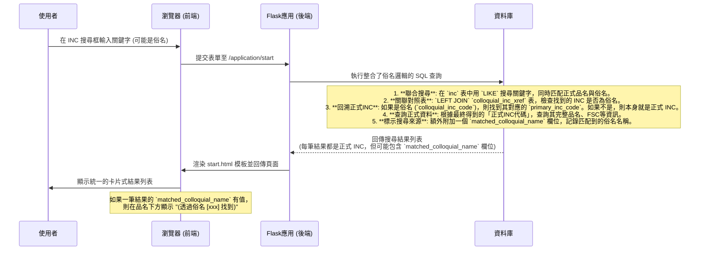

# 整合搜尋流程與俗名處理設計文件

> 版本: 2.0
> 更新日期: 2024-08-01
> 說明: 本文件詳細記錄了料號申編系統第一步驟「FSC/INC 整合查詢」的完整功能設計，特別是俗名(Colloquial Name)的搜尋邏輯與統一化的前端介面呈現。

## 1. 總覽 (Overview)

此功能旨在提供一個統一、直觀且強大的搜尋介面，讓使用者能透過 FSC (聯邦補給分類) 或 INC (品名代碼) 快速找到目標品項以進行後續的料號申編。系統核心挑戰在於處理「正式品名」與「俗名」之間的對應關係，並將所有不同情境的搜尋結果，以一致的 UI/UX 風格呈現給使用者。

## 2. 功能目標 (Functional Goals)

- **支援俗名搜尋**: 使用者輸入俗名關鍵字時，系統應能自動對應到其代表的「正式INC」，並回傳正式INC的資料。
- **統一的介面**: 無論使用者採用何種搜尋條件組合，最終看到的結果列表都應採用相同的卡片式、可展開的佈局。
- **清晰的資訊呈現**:
    - 搜尋結果應以 FSC 進行分組。
    - 若結果是透過俗名找到，需在介面上明確標示，避免使用者混淆。
    - 提供便利的批次操作功能，如「全部展開」與「全部收合」。
- **修正邏輯漏洞**: 確保所有搜尋路徑（特別是「FSC精確代碼 + INC關鍵字」）都能正確處理俗名邏輯。

## 3. 搜尋情境與處理邏輯 (Search Scenarios & Logic)

系統後端會根據使用者輸入的欄位，自動判斷其為「關鍵字」或「代碼」，並執行對應的搜尋邏輯。

| FSC 輸入框 | INC 輸入框 | 搜尋模式 (`search_type`) | 核心處理邏輯 |
| :--- | :--- | :--- | :--- |
| **關鍵字** (非4碼) | **無** | `fsc_only` | 模糊比對 FSC 的標題、包含、排除、備註等欄位。 |
| **代碼** (4碼數字) | **無** | `inc_by_fsc` | 精確查找該 FSC 代碼，並列出其下所有的 INC 品項。 |
| **無** | **關鍵字** | `inc_only` | **(支援俗名)** 模糊比對 INC 品名，將結果解析為正式 INC 後，按其所屬的 FSC 分組回傳。 |
| **無** | **代碼** (5碼數字) | `inc_only` | **精確匹配** INC 代碼，回傳該品項及其所屬的 FSC。 |
| **關鍵字** (非4碼) | **關鍵字** | `fsc_and_inc` | **(支援俗名)** 先模糊搜尋 FSC，再在其範圍內模糊比對 INC 品名，並解析俗名。 |
| **代碼** (4碼數字) | **關鍵字** | `fsc_and_inc` | **(支援俗名)** 在指定的 FSC 代碼範圍內，模糊比對 INC 品名，並解析俗名。 |
| **關鍵字** (非4碼) | **代碼** (5碼數字) | `fsc_and_inc` | 先模糊搜尋 FSC，再從結果中**精確匹配** INC 代碼。 |
| **代碼** (4碼數字) | **代碼** (5碼數字) | `fsc_and_inc` | **精確匹配** FSC 與 INC 代碼，驗證兩者是否存在關聯並回傳。 |

---

## 4. 後端資料流與SQL實現 (Backend Data Flow & SQL Implementation)

為了實現俗名搜尋，後端採用了較為複雜的 SQL 查詢，其核心流程如下圖所示。



### SQL 實現細節

為了實現上述邏輯，查詢使用了 CTE (Common Table Expressions, `WITH` 子句)，主要分為三個步驟：

1.  **`matched_incs`**: 從 `inc` 表中篩選出所有品名符合關鍵字的項目（包含正式與俗名）。
2.  **`resolved_incs`**: 將上一步的結果與 `colloquial_inc_xref` 進行 `LEFT JOIN`。利用 `COALESCE` 函數，將俗名 INC 對應到正式 INC (`official_inc_code`)，並使用 `CASE` 語句產生 `matched_colloquial_name` 欄位。
3.  **最終查詢**: 使用 `resolved_incs` 的結果，去關聯 `inc` (正式品項資料) 和 `fsc` 等表格，組合出最終回傳給前端的完整資料。使用 `STRING_AGG` 來處理一個正式 INC 可能由多個不同俗名對應到的情況。

此查詢邏輯已應用於所有需要處理 INC 關鍵字的搜尋模式，確保了行為的一致性。

---

## 5. 前端介面呈現 (Frontend UI Presentation)

前端 `start.html` 經過多次迭代，最終採用了統一的設計方案。

### 5.1. 結果列表結構

- **卡片式佈局 (`fsc-list-item`)**: 放棄傳統表格，每一筆 FSC 分類的結果都是一個獨立的卡片，視覺上更清晰。
- **卡片標頭 (`fsc-item-header`)**:
    - **左側**: 「選擇 FSC [代碼]」按鈕，寬度固定，方便使用者操作。
    - **右側**: 可點擊區域，包含 FSC 名稱和一個向下箭頭圖示 (`fa-chevron-down`)，提示使用者可以展開。
- **可展開內容 (`fsc-item-details`)**: 點擊標頭右側後，會平滑展開顯示詳細內容。
    - **FSC 詳情**: 若為 `fsc_only` 或 `fsc_and_inc` 搜尋，會顯示「包含」、「排除」、「備註」等資訊。
    - **INC 列表**: 以內嵌表格方式，顯示屬於該 FSC 分類的 INC 品項列表。

### 5.2. 俗名提示

在 INC 列表的表格中，品名 (`item_name`) 欄位的顯示邏輯如下：

```jinja
<td>
    {{ item.item_name or 'N/A' }}
    
        <br><small class="text-white-50 fst-italic"> 
            (透過俗名 "{{ item.matched_colloquial_name }}" 找到) 
        </small>
    
</td>
```
這段程式碼確保了只有當結果是透過俗名找到時，才會顯示額外的提示文字。

### 5.3. 批次操作按鈕

- 在結果區的右上角，提供「<i class="fas fa-plus-square me-1"></i> 全部展開」和「<i class="fas fa-minus-square me-1"></i> 全部收合」兩個按鈕。
- 按鈕為標準尺寸，確保可見性與易用性。
- 透過 JavaScript 監聽點擊事件，並調用 Bootstrap 的 Collapse API，來實現對頁面上所有可展開項目的批次控制。
