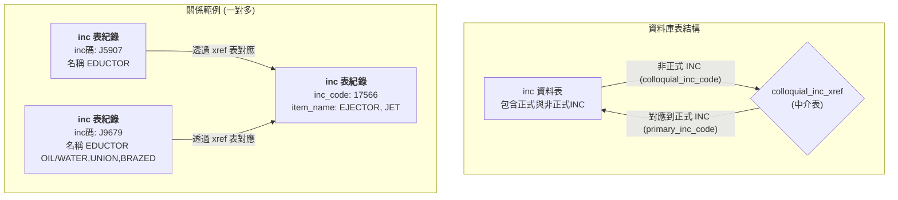
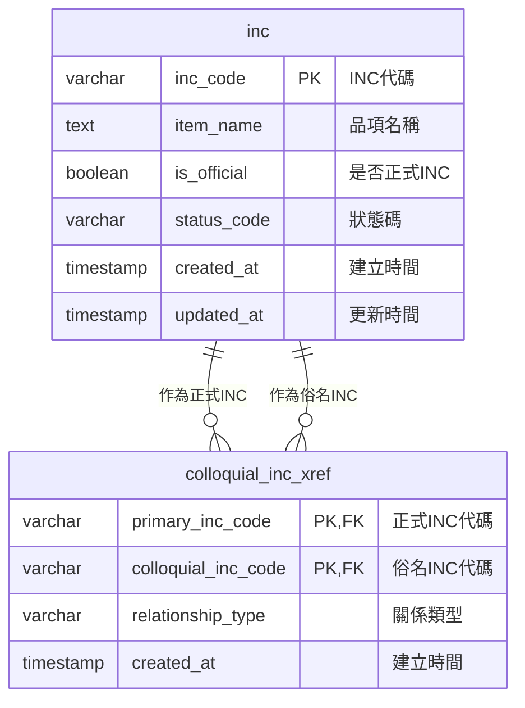
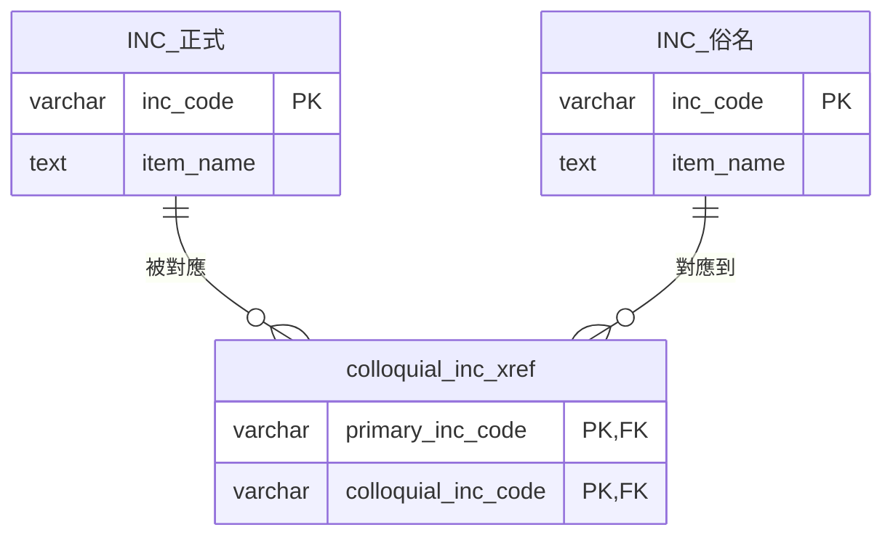
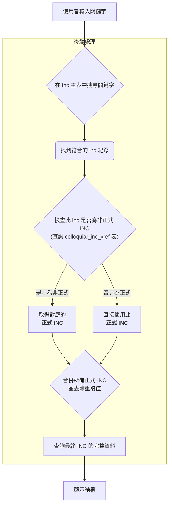

# INC 與俗名 (Colloquial Names) 的關係

## 簡介

在我們的資料庫系統中，一個**品名代號 (INC)** 代表一個標準化的物料品項。然而，在實際應用中，同一個物料可能有多種不同的稱呼或俗名。為了方便使用者查詢，我們建立了一個多對多的關聯，讓一個 INC 可以對應到多個俗名。

## 關聯圖

以下圖表說明了正式與非正式 INC 之間的關聯，它們是透過一個名為 `colloquial_inc_xref` 的中介資料表來連接的。

### ERD 關係說明

- **inc 表**: 同時儲存正式 INC 和俗名 INC
- **colloquial_inc_xref**: 中介表，建立多對多關係
- **關係**: 一個正式 INC 可以有多個俗名，一個俗名也可以對應多個正式 INC

### 簡化版本 (更直觀)

### 圖表說明

1.  **INC 資料表 (`inc`)**: 這個核心資料表同時儲存了兩種品項：
    *   **正式 INC**: 標準的、官方的品項代號及名稱。
    *   **非正式 INC**: 作為「俗名」使用的品項，它們有自己的 `inc_code` 和 `item_name`（即俗名本身）。其 `inc_code` 的格式固定為一個英文字母開頭加上四位數字（例如：`G0001`）。
2.  **中介表 (`colloquial_inc_xref`)**: 核心的關聯表。它的每一行都代表一個「非正式INC」與其對應的「正式INC」之間的關係。

透過這個結構，當系統找到一個「非正式INC」時，可以透過中介表順利地解析出它真正的官方品項是什麼。

## 搜尋流程圖

為了更清楚地說明系統如何利用這個關聯進行搜尋，以下是一個更新後的流程圖，展示了搜尋的內部判斷邏輯。

### 流程說明

1.  **搜尋 `inc` 主表**: 使用者輸入關鍵字後，系統首先在 `inc` 主表中進行全面搜尋，比對 `item_name` 等欄位。
2.  **檢查 INC 類型**: 當找到一筆符合的 `inc` 紀錄時，系統會拿著這筆紀錄的 `inc_code` 去 `colloquial_inc_xref` 中介表中查詢。
    *   **如果查詢得到結果**: 代表剛剛找到的是一個「非正式INC」，系統會從中介表中取得它對應的「正式INC」。
    *   **如果查詢不到**: 代表找到的是一個正常的「正式INC」，可以直接使用。
3.  **合併與去重**: 系統會將所有找到的「正式INC」（無論是直接找到的，還是透過非正式INC轉換來的）收集起來，並移除重複項。
4.  **查詢與顯示**: 最後，系統使用這個整理好的正式INC列表，去查詢完整的品項資料，並呈現給使用者。

這個流程確保了無論使用者搜到的是正式品名還是俗名，最終都能正確地導向到官方的標準品項。