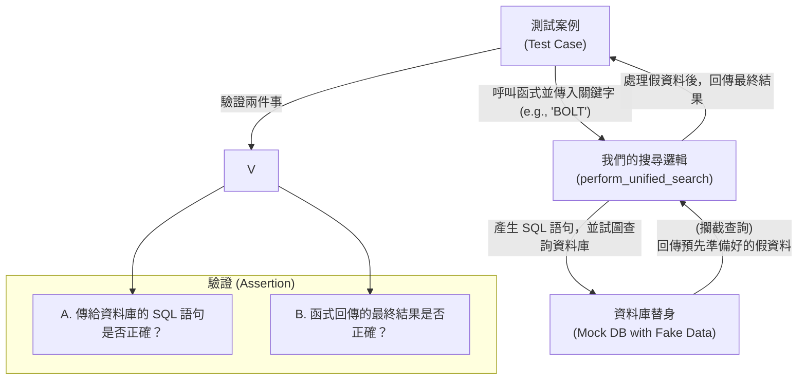

# 單元測試策略 v2.0：視覺化指南

本文檔使用簡單的流程圖與實例，說明我們如何測試核心的搜尋功能。

我們的核心理念是 **「隔離」**：我們只測試搜尋邏輯本身，而將資料庫完全隔離開來。這使得測試變得極快且穩定。

## 運作方式：資料庫替身 (Mock)

我們不使用真實的資料庫，而是建立一個「資料庫替身 (Mock)」。這個替身演員會假裝自己是資料庫，並在我們的搜尋邏輯呼叫它時，回傳我們預先準備好的假資料。

整個流程如下圖所示：



## 一個測試案例的解析

讓我們以 `test_search_fsc_by_keyword_mocked` 為例，看看這一切是如何運作的。

**情境**：使用者想用關鍵字 "BOLT" 搜尋聯邦供應分類 (FSC)。

1.  **安排 (Arrange): 準備材料**
    *   我們在測試程式碼中，手動建立一份關於 "BOLT" 的假資料 (`mock_results`)。
    *   我們告訴「資料庫替身」，當有人來查詢時，就回傳這份假資料。

2.  **執行 (Act): 呼叫功能**
    *   執行我們的搜尋函式：`perform_unified_search(keyword="BOLT", search_type="fsc")`。

3.  **斷言 (Assert): 驗證結果**
    *   **驗證 A (SQL互動)**: 我們檢查搜尋函式送給「資料庫替身」的 SQL 語句，**是否包含 `LIKE '%BOLT%'`**。這確保了程式確實是想做模糊比對。
    *   **驗證 B (最終產出)**: 我們檢查函式最後回傳的結果，**是否與我們在第一步準備的假資料內容相符**。

## 測試案例總覽

下表模擬了使用者在搜尋框中輸入不同內容時，系統應有的反應。

| 測試案例 (節錄) | FSC 輸入框 | INC/俗名 輸入框 | 預期行為 |
| :--- | :--- | :--- | :--- |
| `...fsc_by_keyword...` | "BOLT" | *(留空)* | FSC 文字模糊搜尋 |
| `...inc_by_fsc_code...` | "5305" | *(留空)* | 搜尋此 FSC 代碼下的所有 INC |
| `...by_colloquial_name...` | *(留空)* | "螺絲" | INC 俗名搜尋 |
| `...combined_search...` | "5306" | "BOLT" | FSC 代碼 + INC 文字組合搜尋 |
| `...no_keywords...` | *(留空)* | *(留空)* | 不查詢資料庫，直接回傳空值 |
| **邊界測試** | | | |
| `...fsc_format_boundary...`| "530" 或 "53051" | *(留空)* | FSC 輸入非 4 碼，改為文字模糊搜尋 |
| `...special_characters...` | "%" | "_" | 特殊字元 (`%`, `_`) 視為一般文字 |
| `...one_to_many...` | *(留空)* | "多對一俗名" | 俗名對應多筆 INC 時，須全部回傳 |

## 如何執行測試

執行測試的方式保持不變，您將體驗到一個更快、更穩定、更專注於核心邏輯的單元測試流程。

```bash
pytest -v
```
