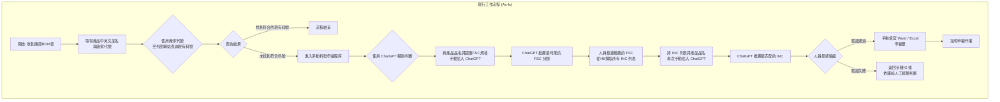
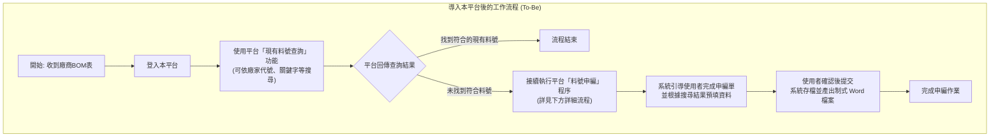

# 核心業務流程圖 (As-Is vs. To-Be)

本文件使用 Mermaid 語法，描繪導入本平台前後的核心業務流程，以呈現系統的核心價值。

## 1. 現行工作流程 (As-Is): 手動搭配 ChatGPT

本圖描繪在導入本平台前，使用者接收到申編需求後，利用外部 ChatGPT 輔助判斷的現行手動處理流程。

---

## 2. 導入本平台後的工作流程 (To-Be)

本圖描繪導入本平台後，預期的全新工作流程。從收到資料開始，所有查詢與申編作業都將在本平台內一站式完成。

---

## 2.1. 平台申編詳細流程

此流程是使用者在本平台內透過關鍵字或代碼，交叉查詢資料庫，最終找到目標品名 (INC) 以進行申編的標準作業程序。

```mermaid
graph TD
    subgraph "平台整合搜尋與申編詳細流程"
        Start["開始<br/>進入料號搜尋頁面"] --> SearchPage["統一搜尋頁面<br/>(提供一般與進階搜尋)"];
        SearchPage --> UserSearches{使用者輸入關鍵字<br/>執行搜尋};
        UserSearches --> ShowMixedResults["顯示混合結果列表<br/>(FSC, INC, NATO H6)"];
        
        ShowMixedResults --> UserSelectsItem{"使用者點擊任一結果"};
        
        UserSelectsItem -- "點擊 FSC" --> ShowFSCRelations["顯示 FSC 細節<br/>及其關聯的 INC 與 H6"];
        UserSelectsItem -- "點擊 INC" --> ShowINCRelations["顯示 INC 細節<br/>及其關聯的 FSC 與 H6"];
        UserSelectsItem -- "點擊 NATO H6" --> ShowH6Relations["顯示 H6 細節<br/>及其關聯的 INC"];
        
        ShowFSCRelations --> UserFindsINC["使用者從關聯列表中<br/>找到並選擇目標 INC"];
        ShowINCRelations --> UserSelectsINC["使用者確認此 INC"];
        ShowH6Relations --> UserFindsINC;
    
        UserFindsINC --> FillForm["填寫申編單"];
        UserSelectsINC --> FillForm;
    
        FillForm --> AutoFill["系統預填欄位<br/>(品名, INC, FIIG...)"];
        AutoFill --> AutoSerial["系統自動產生建議表單編號<br/>(e.g., A0001)"];
        AutoSerial --> UserEdit["使用者確認或修改表單內容<br/>(包含可選填的表單編號)"];
        UserEdit --> SubmitForm{"提交申編單"};
    
        SubmitForm --> SaveData["儲存申編單資料至<br/>web_app.applications"];
        
        SaveData -- "包含: unique_key(不再唯一), form_serial(使用者版), official_nsn(預留)" --> GenerateWord["完成頁面<br/>提供 Word 檔案下載"];
        GenerateWord --> EndProcess["結束"];
    end
```

