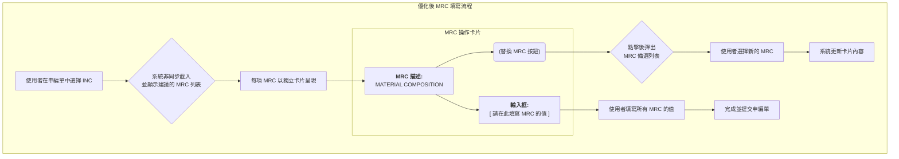
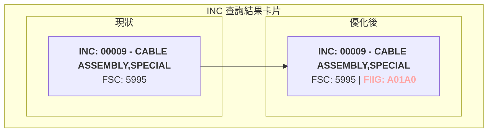
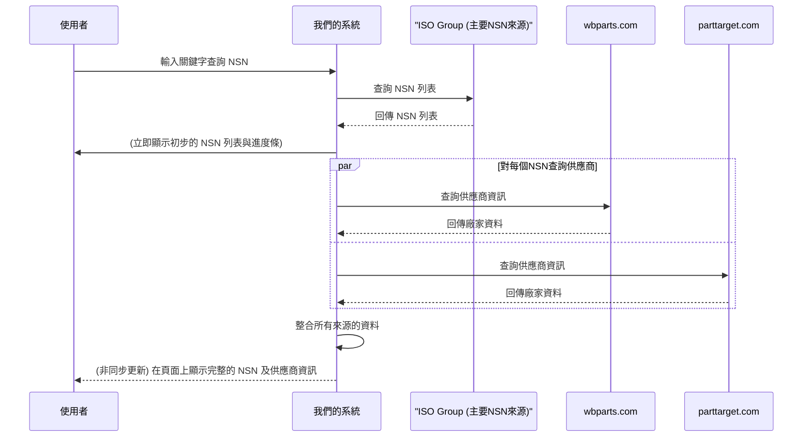
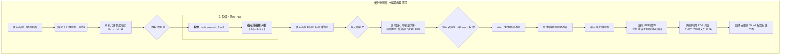

# 系統待辦議題與優化建議 (2025-09-25)

本文件旨在整理當前使用者回饋的問題，並提出相應的技術解決方案與優化方向。

---

## 1. MRC 填寫流程優化

### 1.1 當前問題

使用者在選擇 INC 並由系統自動帶出建議的 MRC (主需求代碼) 後，面臨兩個主要操作瓶頸：
1.  **無法直接填寫值**：系統僅顯示了需要填寫的 MRC 項目（例如：「尺寸」），但沒有提供對應的輸入框讓使用者立即填寫答案（例如：「5mm」）。
2.  **缺乏彈性**：部分由系統建議的 MRC 過於專業或困難，使用者不知道如何填寫，且無法將其替換為其他較為簡單或更合適的 MRC 選項。

### 1.2 解決方案

為了提升使用者體驗的流暢度與彈性，建議進行以下兩項修改：

1.  **在 MRC 卡片中新增輸入框**：在每一個顯示 MRC 項目的卡片下方，直接增加一個文字輸入框，讓使用者能立即填寫對應的值。
2.  **提供 MRC 替換功能**：在每張 MRC 卡片上新增一個「替換」或「變更」按鈕，允許使用者從一個備選的 MRC 列表中，選擇另一個來取代目前的項目。

### 1.3 流程示意圖 (To-Be)

---

## 2. INC 查詢結果增加 FIIG 欄位 (已完成)

### 2.1 當前問題

在料號申編的第一步（`application/start`），使用者查詢 INC 後的結果列表中，只顯示了 FSC、INC 等資訊，缺少了關鍵的 **FIIG** (物品識別指南) 欄位。這使得使用者難以在第一時間判斷所選的 INC 是否合適，需要點擊進去才能看到更多資訊，影響了判斷效率。

### 2.2 解決方案

直接修改查詢結果的顯示卡片，在 INC 資訊旁增加 FIIG 欄位的顯示。

### 2.3 介面示意圖

---

## 3. NSN 爬蟲功能擴充：整合供應商資訊

### 3.1 當前問題

使用者肯定了目前系統透過爬取 [iso-group.com](https://www.iso-group.com) 進行 NSN 查詢並「依數字大小排序」的優點。然而，僅有 NSN 料號本身資訊不足，他們還需要知道該料號的**供應商或製造商是誰**，以進行後續的採購或比對作業。

目前使用者的工作流程是：
1.  在本系統查詢到 NSN 料號。
2.  手動複製此料號。
3.  分別前往 `wbparts.com` 與 `parttarget.com` 這兩個網站進行查詢，交叉比對出供應商資訊。

這個流程繁瑣且耗時。

### 3.2 解決方案

擴充現有的 NSN 爬蟲服務，在查詢到 NSN 列表後，**自動化、非同步地**在背景執行以下任務：
1.  針對列表中的每一個 NSN，分別向 `wbparts.com` 和 `parttarget.com` 發送查詢請求。
2.  解析這兩個網站的回傳結果，提取出供應商/廠家 (Supplier/Manufacturer) 的資訊。
3.  將取得的供應商資訊整合回本系統的結果頁面中，與 NSN 料號並列顯示。

### 3.3 流程示意圖 (To-Be)

---

## 4. 技術端優化：非同步載入體驗 (已完成)

### 4.1 當前問題

在料號申編單頁面，使用者選擇一個 INC 後，系統需要一段時間來查詢與該 INC 關聯的 FIIG、MRC 等後續資料。在此期間，介面僅顯示一個通用的「轉圈圈」載入圖示，且沒有禁止使用者的後續操作。這會導致使用者因不確定系統狀態而**重複點擊**，可能引發非預期的錯誤或重複提交。

### 4.2 解決方案

將此處的載入體驗，比照 NSN 搜尋功能進行優化：
1.  **導入進度條**：當使用者選擇 INC 後，立即顯示一個明確的進度條，讓使用者了解系統正在處理中。
2.  **禁用操作**：在資料載入完成前，將提交按鈕或其他相關操作元件設為禁用 (disabled) 狀態，防止重複點擊。
3.  **完成後恢復**：當後續資料（如 MRC 列表）成功載入並顯示後，隱藏進度條，並恢復所有操作元件為可用狀態。

---

## 5. 附件處理流程增強：支援多檔案與 PDF 頁面擷取

### 5.1 當前問題

使用者在提交申編單時，需要附上多份技術手冊的**特定頁面**作為佐證資料。目前的工作流程是他們手動尋找 PDF 文件，擷取需要的頁面，再自行拼貼到最終的文件中。

目前系統的附件功能存在以下限制：
1.  **不確定是否支援多檔案上傳**：目前介面可能只支援單一附件上傳，無法滿足一次提交多份文件的需求。
2.  **無法處理 PDF 特定頁面**：系統無法讓使用者指定僅附加 PDF 中的某幾頁 (例如：A.pdf 的第 3 頁，B.pdf 的第 10 頁)，而是會將整個文件作為附件。
3.  **缺乏檔案類型區分處理**：系統未區分圖片與 PDF。理想情況下，圖片應嵌入 Word 報告的特定位置，而 PDF 的指定頁面應附加到 Word 報告的末尾。

所有附件都需要與申編單一同儲存，以便在退件修改時能夠一併調閱和編輯。

### 5.2 解決方案

建議對附件處理模組進行全面升級，實現以下功能：

1.  **啟用多檔案上傳介面**：更新前端表單，允許使用者一次選取並上傳多個附件。
2.  **開發 PDF 頁面指定功能**：
    *   在使用者上傳 PDF 檔案後，介面上提供一個輸入框，讓使用者能指定需要擷取的頁碼 (格式可為 `3, 10-12`)。
    *   後端引入 PDF 處理函式庫 (如 PyPDF2 或 PyMuPDF)，用於根據使用者指定的頁碼，從原始 PDF 中擷取出特定頁面。
3.  **智慧化 Word 文件生成**：
    *   修改 Word 生成服務的邏輯。
    *   **圖片類附件**：維持現有邏輯，嵌入文件內指定位置。
    *   **PDF 類附件**：在生成主要申編單內容後，將擷取出的 PDF 頁面（可考慮轉為圖片格式以確保相容性）逐一附加到 Word 文件的末尾。
4.  **確保資料持久化**：所有上傳的原始檔案、檔案類型、以及使用者指定的 PDF 頁碼等資訊，都儲存在 `application_attachments` 表中，與申編單主紀錄關聯。

### 5.3 流程示意圖 (To-Be)

